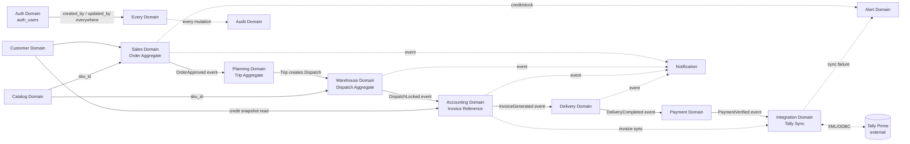
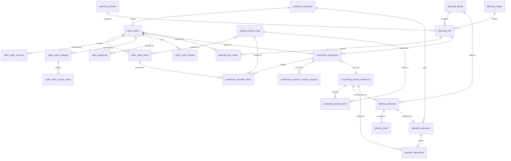

# Database Schema Design Document
## FMCG Distribution ERP — Phase 1

| | |
|---|---|
| **Document Type** | Database Schema Design Specification |
| **System** | FMCG Distributor ERP |
| **Phase** | Phase 1 (Order-to-Invoice Digitalization) |
| **Version** | 1.0 |
| **Status** | Draft for Engineering Sign-off |
| **Database Engine** | PostgreSQL 15+ |
| **ORM** | Prisma |
| **Methodology** | Domain-Driven Design (DDD) — one schema section per bounded context |
| **Built following** | `docs/database_design_schema.md` (Database Schema Design Cheat Sheet) |
| **Consolidates** | `docs/database_docs/complete_database_schema.md`, `auth_domain.md`, `customer_domain.md`, `catalog_domain.md`, and every design chat in `docs/` |

This document is organized exactly per the 10-step workflow in the cheat sheet: Product Understanding → Entities → Tables → Primary Keys → Standard Columns → Relationships → Foreign Keys → ER Diagram → Validation → Performance Review — ending in the "Final Deliverables" checklist the cheat sheet requires before implementation begins.

---

## Table of Contents

1. [Step 1 — Product & Requirements Understanding](#step-1)
2. [Step 2 — Entity Identification](#step-2)
3. [Step 3 — Domain-by-Domain Table Definitions](#step-3)
4. [Step 4 — Primary Key Standard](#step-4)
5. [Step 5 — Standard Columns Standard](#step-5)
6. [Step 6 — Relationship Types Used](#step-6)
7. [Step 7 — Foreign Key Naming & Cross-Domain FK Registry](#step-7)
8. [Step 8 — Entity-Relationship Diagrams](#step-8)
9. [Step 9 — Schema Validation (Red-Flag Check)](#step-9)
10. [Step 10 — Performance Review: Indexes, Constraints, Cascades](#step-10)
11. [Data Dictionary — All Enumerations](#data-dictionary)
12. [Naming Standards](#naming-standards)
13. [Migration Plan](#migration-plan)
14. [Final Deliverables Checklist](#final-deliverables)

---

## Step 1 — Product & Requirements Understanding

### Product
**Name:** FMCG Distributor ERP — Phase 1: Order-to-Invoice Digitalization Platform

### Goal
Digitize an FMCG distributor's manual order-to-invoice process (currently phone/WhatsApp/paper, re-typed into Tally Prime by an accountant) into a connected platform — **without replacing Tally**. Tally remains system of record for Inventory, Ledger, GST, and Invoice numbering; this system owns Order, Dispatch, Delivery, Payment, and Customer/Catalog data, and pushes finished transactions into Tally.

### Users
Customer (retailer), Salesman, Sales Manager, Admin, Warehouse Supervisor/Loader, Accountant, Driver, Cashier. Full persona detail: `docs/PRD.md` Section 3.

### What users can do (feature summary — drives entity extraction below)
- Register/login (internal staff via OTP; customers via separate OTP flow).
- Browse a multi-level product catalogue (Company → Brand → Product → SKU → Packing → Price) and place orders.
- Approve orders, request/approve post-approval order changes.
- Plan trips (vehicle + driver + route), attach approved orders.
- Load a dispatch against a trip, capturing ordered-vs-loaded quantity variance with reasons.
- Generate a Tally invoice from a locked dispatch, with retry-safe sync.
- Deliver goods, capture proof of delivery.
- Collect and verify payment (cash/UPI/cheque), post receipt to Tally.
- Receive notifications; view alerts; view audit history; view reports.

### Governing design rules (carried into every table below)
1. **Objects are never overwritten into their next stage** — Order → Dispatch → Invoice → Delivery → Payment are separate, permanently linked aggregates.
2. **Tally is the source of truth** for Inventory, Ledger, GST, Invoice numbering — our tables in that area are explicitly snapshots/read-models, refreshed by the Integration domain, never user-edited.
3. **Decision-support, not decision-making** — credit/stock conditions raise `alert_*` rows, never block a transaction.
4. **Every mutable lifecycle has a `status` enum plus a companion `*_history`/`*_timeline` table** — state transitions are never lost.
5. **UUID primary keys everywhere** — required for merge-safety on offline-first mobile clients (Flutter + Drift/SQLite).
6. **Soft delete only** on customer- or finance-adjacent tables, via `status`/`active`, never a hard `DELETE`.

---

## Step 2 — Entity Identification

Nouns extracted from the feature list above, grouped into their owning bounded context (domain). Each domain maps to one backend module and one logical schema namespace (table prefix).

| # | Domain (prefix) | Core Entities (nouns) |
|---|---|---|
| 1 | `auth_` | User, Role, Permission, Session, Device, OTP, RefreshToken, LoginHistory |
| 2 | `customer_` | Customer, CustomerAuth, Address, Contact, Salesman-Assignment, Route-Assignment, PriceList-Assignment, CreditSnapshot, LedgerMapping, Document, Settings, Activity |
| 3 | `catalog_` | Category, Company, Brand, Product, SKU, Packing, PriceList, Price, Image, Barcode, Tax, Attribute, AttributeValue, Visibility |
| 4 | `sales_` | Order, OrderItem, OrderRevision, OrderChange, OrderChangeItem, Approval, OrderTimeline |
| 5 | `planning_` | Vehicle, Driver, Route, Trip, TripOrder, TripStatusHistory, VehicleDocument, RouteSequence |
| 6 | `warehouse_` | Dispatch, DispatchItem, DispatchChangeRequest, DispatchChangeRequestItem, LoadingHistory, DispatchTimeline |
| 7 | `accounting_` | InvoiceReference, InvoiceItem, LedgerSnapshot, GSTSummary, OutstandingSnapshot |
| 8 | `delivery_` | Delivery, DeliveryProof, DeliveryStatusHistory, DeliveryExpense |
| 9 | `payment_` | Payment, PaymentAllocation, PaymentReceipt, PaymentVerification, PaymentStatusHistory |
| 10 | `notification_` | NotificationTemplate, NotificationChannel, NotificationLog, NotificationPreference |
| 11 | `audit_` | AuditLog, ActivityFeed |
| 12 | `integration_` | TallySyncQueue, TallySyncLog, TallyMapping, TallyConfig |
| 13 | `alert_` | AlertType, Alert, AlertRecipient |

**Feature → Entity mapping (sample, confirms nothing is missing):**

| Feature | Primary Entity |
|---|---|
| Staff login via OTP | `auth_users`, `auth_otps`, `auth_sessions` |
| Customer login | `customer_customers`, `customer_auth` |
| Browse catalogue | `catalog_products`, `catalog_product_skus`, `catalog_product_prices` |
| Place order | `sales_orders`, `sales_order_items` |
| Approve / change order | `sales_approvals`, `sales_order_changes` |
| Plan trip | `planning_trips`, `planning_trip_orders` |
| Load dispatch | `warehouse_dispatches`, `warehouse_dispatch_items` |
| Generate invoice | `accounting_invoice_references`, `integration_tally_sync_queue` |
| Deliver goods | `delivery_deliveries`, `delivery_proof` |
| Collect payment | `payment_payments`, `payment_verifications` |
| Notify user | `notification_logs` |
| Raise alert | `alert_alerts` |
| Audit trail | `audit_logs` |

**Explicitly excluded entities for Phase 1** (would be nouns in a full ERP, deliberately deferred): Stock/Inventory/Batch/Expiry, Purchase Order, Supplier, Warehouse-location/Bin, Ledger/Journal/Chart-of-Accounts (all remain Tally-owned or later-phase). See `docs/PRD.md` Section 4.2 and `phase_1_roadmap.md` Section 9.

---

## Step 3 — Domain-by-Domain Table Definitions

Each of the 83 Phase-1 tables is fully specified — purpose, every column with type, primary key, unique fields, indexes, and relationships — in **`docs/database_docs/complete_database_schema.md`**, which this document treats as the authoritative field-level appendix (it is reproduced there exactly per-domain, one section per bounded context, matching the structure mandated below). Do not duplicate that field-by-field listing here; instead, this section gives the **table inventory** and **one-line purpose** per table, so this document is self-contained for review, while the full column list is one click away.

### 3.1 Auth Domain — 10 tables
Identity/authorization for **internal users only** (never customers).

| Table | Purpose |
|---|---|
| `auth_users` | One row per internal staff member (Admin/Salesman/Warehouse/Accountant/Driver/Cashier) |
| `auth_roles` | Named role catalogue (ADMIN, SALESMAN, …) |
| `auth_permissions` | Atomic, granular permission catalogue (`order.approve`, `dispatch.edit`, …) |
| `auth_role_permissions` | Bridge: Role ↔ Permission (many-to-many) |
| `auth_user_roles` | Bridge: User ↔ Role (many-to-many, supports multi-role users) |
| `auth_sessions` | Active/expired login sessions |
| `auth_devices` | Trusted device registry, push tokens |
| `auth_otps` | OTP issuance/verification records |
| `auth_refresh_tokens` | JWT refresh token hashes (never raw tokens) |
| `auth_login_history` | Security audit of every login attempt |

### 3.2 Customer Domain — 12 tables
Business identity of buyers; never owns Orders/Invoices/Ledger.

| Table | Purpose |
|---|---|
| `customer_customers` | Aggregate root — one row per retailer/shopkeeper |
| `customer_auth` | Customer login/OTP state (1:1, separate from `auth_*`) |
| `customer_addresses` | Billing/shipping/shop/warehouse addresses (1:N) |
| `customer_contacts` | Named contacts at the customer's business (1:N) |
| `customer_salesmen` | Bridge: Customer ↔ Salesman (`auth_users`), supports shared customers |
| `customer_routes` | Bridge: Customer ↔ `planning_routes`, delivery day/frequency |
| `customer_price_lists` | Bridge: Customer ↔ `catalog_price_lists`, effective-dated |
| `customer_credit_snapshot` | Read-only credit/outstanding snapshot synced from Accounting |
| `customer_ledger_mapping` | Bridge to Tally ledger GUID |
| `customer_documents` | KYC document uploads (GST/PAN/license/photos) |
| `customer_settings` | Notification/language/theme preferences |
| `customer_activity` | Business activity log (registered, salesman changed, …) |

### 3.3 Catalog Domain — 13 tables
Sellable product hierarchy; owns no stock quantities.

| Table | Purpose |
|---|---|
| `catalog_categories` | Self-referencing category tree (supports subcategories) |
| `catalog_companies` | Manufacturer master (Parle, HUL, Coca-Cola, …) |
| `catalog_brands` | Brand, belongs to Company |
| `catalog_products` | Product master (e.g. "Coca-Cola") — not directly sellable |
| `catalog_product_skus` | The actual sellable variant (e.g. "Coca-Cola 250ml") — aggregate root for pricing/ordering |
| `catalog_product_packings` | Packing configurations per SKU ("24 Bottles/Crate") |
| `catalog_price_lists` | Named price list master (MRP/Distributor/Wholesale/Special) |
| `catalog_product_prices` | SKU price per price list, effective-dated |
| `catalog_product_images` | SKU images, one marked primary |
| `catalog_product_barcodes` | Multiple barcodes per SKU |
| `catalog_product_taxes` | GST/cess per SKU, effective-dated |
| `catalog_product_attributes` | Generic attribute catalogue (flavor, color, …) |
| `catalog_product_attribute_values` | SKU ↔ attribute value pairs |
| `catalog_product_visibility` | Future: per-customer catalogue restriction |

### 3.4 Sales Domain — 7 tables (Order Aggregate)
Captures demand up to approval and post-approval change; owns nothing about Vehicle/Loading/Invoice.

| Table | Purpose |
|---|---|
| `sales_orders` | Aggregate root — one row per order, carries `status` state machine |
| `sales_order_items` | Line items, tagged with the revision they belong to |
| `sales_order_revisions` | Immutable snapshot per version — append-only |
| `sales_order_changes` | Tracked post-approval change request (the "Order Change" object) |
| `sales_order_change_items` | Line-level detail of a change request |
| `sales_approvals` | Approval/rejection decision as its own entity, not just a status flip |
| `sales_order_timeline` | Append-only business event log per order |

### 3.5 Planning Domain — 8 tables (Trip Aggregate)
Bridges "order approved" to "warehouse starts loading."

| Table | Purpose |
|---|---|
| `planning_vehicles` | Vehicle master |
| `planning_drivers` | Driver master |
| `planning_routes` | Delivery route master |
| `planning_route_sequences` | Customer visiting order within a route |
| `planning_trips` | Aggregate root — one vehicle/driver/route/date, carries `status` state machine |
| `planning_trip_orders` | Bridge: Trip ↔ Order (many orders per trip) |
| `planning_trip_status_history` | Append-only trip state transitions |
| `planning_vehicle_documents` | RC/insurance/permit/fitness documents, with expiry |

### 3.6 Warehouse Domain — 6 tables (Dispatch Aggregate)
"What actually left the warehouse" — independent of what was ordered.

| Table | Purpose |
|---|---|
| `warehouse_dispatches` | Aggregate root — one per order-on-trip, carries `status` state machine |
| `warehouse_dispatch_items` | Ordered qty vs. loaded qty, with reason code on variance |
| `warehouse_dispatch_change_requests` | Loader-submitted change requiring Sales/Admin approval |
| `warehouse_dispatch_change_request_items` | Line-level detail of a change request |
| `warehouse_loading_history` | Append-only log of every quantity edit |
| `warehouse_dispatch_timeline` | Append-only business event log per dispatch |

### 3.7 Accounting Domain — 5 tables (Invoice Reference — Tally-owned)
Stores references/snapshots only; Tally is the authoritative financial record.

| Table | Purpose |
|---|---|
| `accounting_invoice_references` | Aggregate root — links Dispatch → Tally invoice number/PDF |
| `accounting_invoice_items` | Immutable copy of dispatch items at invoicing time |
| `accounting_ledger_snapshot` | Customer ledger balance, synced from Tally |
| `accounting_gst_summary` | HSN-level tax breakdown per invoice |
| `accounting_outstanding_snapshot` | Outstanding/overdue amount, feeds `customer_credit_snapshot` |

### 3.8 Delivery Domain — 4 tables
Physical handover; independent of Invoice status.

| Table | Purpose |
|---|---|
| `delivery_deliveries` | Aggregate root — carries `status` state machine |
| `delivery_proof` | Signature/photo/GPS proof-of-delivery |
| `delivery_status_history` | Append-only delivery state transitions |
| `delivery_expenses` | Driver trip expenses (fuel/toll/misc) |

### 3.9 Payment Domain — 5 tables
Collection and settlement; references Invoice, never modifies it.

| Table | Purpose |
|---|---|
| `payment_payments` | Aggregate root — one collection event |
| `payment_allocations` | One payment spread across multiple invoices |
| `payment_receipts` | Cash photo / UPI screenshot / cheque detail |
| `payment_verifications` | Cashier/Accountant verification decision |
| `payment_status_history` | Append-only payment state transitions |

### 3.10 Notification Domain — 4 tables
Event-driven outbound messaging; never called directly by other domains.

| Table | Purpose |
|---|---|
| `notification_templates` | Message template per event type + channel |
| `notification_channels` | Channel provider configuration (Push/SMS/WhatsApp/Email) |
| `notification_logs` | One row per message sent, polymorphic recipient |
| `notification_preferences` | Internal-user opt-in/out per event type + channel |

### 3.11 Audit Domain — 2 tables
Technical, field-level change history — distinct from business timelines.

| Table | Purpose |
|---|---|
| `audit_logs` | Who/when/old-value/new-value/IP/device for every mutation, polymorphic entity reference |
| `audit_activity_feed` | Denormalized cross-domain feed for "recent activity" dashboards |

### 3.12 Integration Domain — 4 tables
The **only** domain permitted to know Tally exists.

| Table | Purpose |
|---|---|
| `integration_tally_sync_queue` | Retry-safe outbound queue (invoice/ledger/stock/payment-receipt) |
| `integration_tally_sync_log` | Per-attempt request/response XML log |
| `integration_tally_mapping` | Local UUID ↔ Tally GUID bridge, generalized across entity types |
| `integration_tally_config` | Connection settings (XML endpoint, ODBC DSN, sync interval) |

### 3.13 Alert Domain — 3 tables
Implements "decision support, not decision making."

| Table | Purpose |
|---|---|
| `alert_types` | Alert catalogue (CREDIT_LIMIT_EXCEEDED, STOCK_SHORTAGE, …) with default severity |
| `alert_alerts` | One raised alert instance, polymorphic entity reference |
| `alert_recipients` | Who an alert was routed to, and their acknowledgement state |

**Total: 83 tables across 13 domains** for Phase 1. (Table count and per-domain breakdown verified against `complete_database_schema.md` Table Count Summary.)

---

## Step 4 — Primary Key Standard

| Rule | Applied |
|---|---|
| Every table has a primary key | ✅ all 83 tables |
| Type | `UUID` (v4), generated application-side or via `gen_random_uuid()` |
| Never use business fields as PK | ✅ `email`, `mobile`, `username`, `gst_number` are all UNIQUE constraints, never primary keys |
| Reason | UUIDs are merge-safe across the offline-first mobile clients (Salesman/Warehouse/Driver apps write locally via Drift/SQLite while offline, then sync) — an auto-increment integer PK would collide across devices |

Junction/bridge tables (`auth_role_permissions`, `auth_user_roles`, `customer_salesmen`, `planning_trip_orders`, `payment_allocations`, etc.) still get their own surrogate `id UUID PK`, in addition to a `UNIQUE(a_id, b_id)` composite constraint — never a composite primary key. This keeps every table's shape identical (single-column PK), which simplifies the Prisma model generation and any future CDC/replication tooling.

---

## Step 5 — Standard Columns Standard

Applied to **every** table unless explicitly noted (append-only history/timeline tables omit `updated_at`/`updated_by` since they are never updated):

| Column | Type | Applies to |
|---|---|---|
| `id` | UUID PK | All tables |
| `created_at` | TIMESTAMPTZ, default `now()` | All tables |
| `updated_at` | TIMESTAMPTZ, auto-updated | All mutable tables (omitted on append-only `*_history`/`*_timeline`/`*_log` tables) |
| `created_by` | UUID FK → `auth_users.id` | All internal-staff-originated tables (nullable where the row can originate from a customer instead — see `created_by_customer_id` pattern in `sales_orders`) |
| `updated_by` | UUID FK → `auth_users.id` | Same tables as `updated_at` |
| `status` / `active` | ENUM or BOOLEAN | Every table representing a lifecycle or a soft-deletable master record |
| `deleted_at` | TIMESTAMPTZ, nullable | Reserved pattern, not activated in Phase 1 — Phase 1 uses `status`/`active` flags instead of soft-delete timestamps, since every lifecycle table already carries a status enum that serves the same purpose without an extra column |

**Why this matters (per the cheat sheet):** these columns are what let the system support audit history, chronological sorting, debugging, soft delete, and analytics without a schema change later. Retrofitting them after data exists is expensive; they are included from the first migration.

---

## Step 6 — Relationship Types Used

| Type | Example in this schema | Implementation |
|---|---|---|
| **One-to-One** | `customer_customers` ↔ `customer_auth`; `customer_customers` ↔ `customer_credit_snapshot`; `warehouse_dispatches` ↔ `accounting_invoice_references`; `accounting_invoice_references` ↔ `delivery_deliveries` | FK with a `UNIQUE` constraint on the referencing column |
| **One-to-Many** | `catalog_products` → `catalog_product_skus`; `sales_orders` → `sales_order_items`; `planning_trips` → `warehouse_dispatches` | Plain FK on the "many" side |
| **Many-to-Many** | User ↔ Role, Role ↔ Permission, Customer ↔ Salesman, Trip ↔ Order, Payment ↔ Invoice | **Always via a bridge/junction table** — `auth_user_roles`, `auth_role_permissions`, `customer_salesmen`, `planning_trip_orders`, `payment_allocations`. Never a direct many-to-many FK. |
| **Polymorphic (deliberate exception)** | `audit_logs.entity_type` + `entity_id`; `alert_alerts.entity_type` + `entity_id` | No hard FK — by design, since these two tables are the only ones meant to reference *any* aggregate root across all 13 domains. Application-layer validated, not DB-enforced. |
| **Self-referencing** | `catalog_categories.parent_category_id` → `catalog_categories.id` | Nullable FK to the same table, enables category trees |

No circular hard-FK relationships exist anywhere in the schema (validated in Step 9).

---

## Step 7 — Foreign Key Naming & Cross-Domain FK Registry

### Naming convention
`<referenced_entity_singular>_id` — e.g. `user_id`, `customer_id`, `order_id`, `sku_id`, `dispatch_id`, `invoice_reference_id`. Where a table has more than one FK to the same target table, the column is prefixed with its role, not renamed generically — e.g. `sales_orders.salesman_user_id` vs. `sales_order_changes.approved_by` (both → `auth_users.id`), never `uid`, `usr`, `owner`, or `creator`.

### Cross-domain foreign key registry
This is the authoritative list of every FK that crosses a domain boundary — the connective tissue of the whole schema:

| From Table | Column | To Table | Relationship |
|---|---|---|---|
| `customer_salesmen` | `salesman_user_id` | `auth_users` | Customer ↔ internal staff |
| `customer_documents` | `uploaded_by` | `auth_users` | |
| `customer_routes` | `route_id` | `planning_routes` | Customer ↔ Planning |
| `customer_price_lists` | `price_list_id` | `catalog_price_lists` | Customer ↔ Catalog |
| `sales_orders` | `customer_id` | `customer_customers` | Order belongs to Customer |
| `sales_orders` | `salesman_user_id` | `auth_users` | Order assigned to Salesman |
| `sales_order_items` | `sku_id` | `catalog_product_skus` | Order line references SKU |
| `sales_approvals` | `approved_by` | `auth_users` | |
| `planning_trip_orders` | `order_id` | `sales_orders` | Trip carries Order |
| `planning_drivers` | `user_id` | `auth_users` | Driver may have app login |
| `warehouse_dispatches` | `trip_id` | `planning_trips` | Dispatch created from Trip |
| `warehouse_dispatches` | `order_id` | `sales_orders` | Dispatch created from Order |
| `warehouse_dispatch_items` | `order_item_id` | `sales_order_items` | Traceability to what was ordered |
| `warehouse_dispatch_items` | `sku_id` | `catalog_product_skus` | |
| `accounting_invoice_references` | `dispatch_id` | `warehouse_dispatches` | Invoice created from Dispatch |
| `accounting_invoice_references` | `customer_id` | `customer_customers` | |
| `accounting_invoice_items` | `sku_id` | `catalog_product_skus` | |
| `delivery_deliveries` | `invoice_reference_id` | `accounting_invoice_references` | Delivery created from Invoice |
| `delivery_deliveries` | `trip_id` | `planning_trips` | |
| `delivery_deliveries` | `driver_id` | `planning_drivers` | |
| `payment_payments` | `delivery_id` | `delivery_deliveries` | Payment linked to Delivery (nullable) |
| `payment_payments` | `customer_id` | `customer_customers` | |
| `payment_payments` | `collected_by` | `auth_users` | |
| `payment_allocations` | `invoice_reference_id` | `accounting_invoice_references` | Settles Invoice |
| `integration_tally_mapping` | `local_id` | *(polymorphic: `customer_customers` / `catalog_products` / `accounting_invoice_references`)* | GUID bridge |
| `alert_alerts` | `entity_id` | *(polymorphic — any aggregate root)* | No hard FK, by design |
| `audit_logs` | `entity_id` | *(polymorphic — any aggregate root)* | No hard FK, by design |

Every domain's `created_by` / `updated_by` / role-holder columns (`salesman_user_id`, `loading_supervisor_id`, `collected_by`, `verified_by`, `decided_by`, `approved_by`, `generated_by`, `performed_by`, etc.) are foreign keys into `auth_users.id` — Auth is the one domain every other domain depends on, never the reverse.

---

## Step 8 — Entity-Relationship Diagrams

### 8.1 Master domain-flow ERD

### 8.2 Core order-to-cash entity relationship diagram

### 8.3 Auth / Customer / Catalog domain-internal diagrams
Reproduced in full (with all bridge tables) in the per-domain source docs — `auth_domain.md` §"ER Diagram", `customer_domain.md` §"ER Diagram", `catalog_domain.md` §"ER Diagram" — and are treated as authoritative without duplication here.

**Living-document rule:** whenever a table or FK changes in `complete_database_schema.md`, the diagrams above must be updated in the same PR — the ERD is kept synchronized with the schema, never left to drift, per the cheat sheet's Step 8 guidance.

---

## Step 9 — Schema Validation (Red-Flag Check)

Checked against the cheat sheet's explicit red-flag list:

| Red Flag | Status | Note |
|---|---|---|
| ❌ Duplicate information | **Clear** | Financial totals (ledger, outstanding, GST) live once, in Accounting, and are *read* elsewhere as explicit snapshot tables (`customer_credit_snapshot`), never copy-pasted into Customer/Sales tables as live fields |
| ❌ Missing primary keys | **Clear** | All 83 tables carry a UUID PK (Step 4) |
| ❌ Missing foreign keys | **Clear** | Every relationship in Step 6/7 is backed by an explicit FK column, except the two deliberately polymorphic tables (Audit, Alert) |
| ❌ Circular relationships | **Clear** | The domain-flow diagram (8.1) is a DAG — Customer→Sales→Planning→Warehouse→Accounting→Delivery→Payment never loops back into an earlier domain's writable tables. Integration is the only domain that talks to an external system (Tally) and it is one-directional in ownership (writes go out, snapshots come back into clearly separate `*_snapshot`/`*_mapping` tables) |
| ❌ Huge tables | **Clear** | No single table exceeds ~20 columns; wide concepts (e.g. Order) are deliberately split across 7 tables (`sales_*`) instead of one monolithic `orders` table with 60 columns |
| ❌ Business logic inside IDs | **Clear** | All PKs are opaque UUIDs; human-readable identifiers (`order_number`, `customer_code`, `sku_code`, `dispatch_number`) are separate, non-PK, UNIQUE columns |
| ❌ Nullable columns that shouldn't be nullable | **Reviewed** | Nullability is deliberate and documented per table — e.g. `sales_orders.salesman_user_id` is nullable *only* because a customer-placed order may have no salesman yet; `payment_payments.delivery_id` is nullable *only* because payment can be collected independent of a delivery event. Every nullable FK has a stated business reason in `complete_database_schema.md` |
| ❌ Missing timestamps | **Clear** | `created_at` present on all 83 tables (Step 5) |

### Additional domain-specific invariants validated
- **Immutability rule:** `sales_order_revisions`, `warehouse_loading_history`, `accounting_invoice_items`, and every `*_timeline`/`*_history` table are append-only by contract — enforced at the application/service layer (no `UPDATE`/`DELETE` verbs exposed for these tables), not just convention.
- **No stock fields inside Catalog:** verified zero occurrences of `available_stock`, `reserved_stock`, `warehouse_stock`, `batch_number`, `expiry_date` in any `catalog_*` table — those belong to the explicitly out-of-scope Inventory Domain (Phase 2–4).
- **No direct many-to-many FK:** verified every M:N relationship (Step 6) resolves through a bridge table.

---

## Step 10 — Performance Review: Indexes, Constraints, Cascades

### 10.1 Index strategy

| Pattern | Rule | Examples |
|---|---|---|
| Every FK column | Indexed (Postgres does not auto-index FKs) | `sales_orders.customer_id`, `warehouse_dispatch_items.dispatch_id`, `payment_allocations.invoice_reference_id` |
| Every `UNIQUE` business identifier | Unique index | `auth_users.mobile`, `auth_users.employee_code`, `customer_customers.customer_code`, `customer_customers.gst_number`, `catalog_product_skus.sku_code`, `sales_orders.order_number`, `planning_vehicles.registration_number` |
| Every `status`/lifecycle column on a high-volume table | B-tree index, often composite with a date | `sales_orders(status, created_at)`, `warehouse_dispatches(status)`, `payment_payments(status)`, `integration_tally_sync_queue(status, next_retry_at)` |
| Polymorphic lookup tables | Composite index on `(entity_type, entity_id)` | `audit_logs(entity_type, entity_id)`, `alert_alerts(entity_type, entity_id)` |
| Time-range / reporting queries | Index on `created_at` / date fields used in reports | `sales_order_timeline(occurred_at)`, `payment_payments(collected_at)`, `notification_logs(sent_at)` |
| Full-text search | Postgres `GIN`/`tsvector` (Phase 1), Elasticsearch deferred | `catalog_products(product_name, short_name)`, `catalog_product_skus(sku_name)` — per `roadmap_from_first_chat.md`'s stated search strategy |

Naming convention for explicit named indexes: `idx_<table>_<column(s)>` — e.g. `idx_sales_orders_customer_id`, `idx_audit_logs_entity`, `idx_users_email` per the cheat sheet's own examples.

### 10.2 Constraints

| Constraint type | Where applied |
|---|---|
| `NOT NULL` | All required business fields — e.g. `sales_orders.customer_id`, `sales_orders.order_number`, `warehouse_dispatch_items.loaded_qty`, `payment_payments.amount` |
| `UNIQUE` | Human-facing identifiers and 1:1 relationship FKs — e.g. `customer_customers.mobile`, `catalog_product_skus.sku_code`, `customer_auth.customer_id`, `(role_id, permission_id)` on `auth_role_permissions`, `(user_id, role_id)` on `auth_user_roles` |
| `CHECK` | Numeric sanity — e.g. `warehouse_dispatch_items.loaded_qty >= 0`, `payment_payments.amount > 0`, `sales_order_items.discount_percentage BETWEEN 0 AND 100`, `catalog_product_prices.effective_to IS NULL OR effective_to > effective_from` |
| `DEFAULT` | `status` columns default to their initial state (e.g. `sales_orders.status DEFAULT 'DRAFT'`), boolean flags default `false`, `created_at DEFAULT now()` |
| Reason-code enforcement | `warehouse_dispatch_items.reason` is `NOT NULL` **only when** `loaded_qty <> ordered_qty` — enforced via application-layer validation (documented, not a DB trigger, per the "business logic belongs to the service layer" convention in `phase_1_roadmap.md`) |

### 10.3 Cascade rules

| Relationship | Rule | Reason |
|---|---|---|
| Parent aggregate → its own child rows (e.g. `sales_orders` → `sales_order_items`, `warehouse_dispatches` → `warehouse_dispatch_items`) | `ON DELETE RESTRICT` (in practice: deletes are never issued — soft delete via `status` is the only supported path) | Financial/audit-relevant rows are never physically removable |
| `auth_user_roles`, `auth_role_permissions` (pure bridge tables) | `ON DELETE CASCADE` | Removing a role/permission assignment is safe and expected; the parent entities themselves are unaffected |
| `catalog_product_images`, `catalog_product_barcodes`, `catalog_product_attribute_values` | `ON DELETE CASCADE` from their owning SKU | Presentation-only child data with no independent business meaning |
| `*_history` / `*_timeline` / `*_log` tables | No cascade defined — these are never deleted, and the parent row they describe is never hard-deleted either | Enforces the immutability rule from Step 9 |
| Cross-domain aggregate links (`warehouse_dispatches.order_id`, `accounting_invoice_references.dispatch_id`, `delivery_deliveries.invoice_reference_id`) | `ON DELETE RESTRICT`, `ON UPDATE CASCADE` | An Order/Dispatch/Invoice must never be deletable while a downstream object references it — this is the database-level enforcement of Rule #1 in Step 1 ("objects create the next object, never overwrite") |

### 10.4 Data type standards

| Data category | Type | Precision |
|---|---|---|
| Money (price, amount, GST, totals) | `DECIMAL(14,2)` minimum | Never `FLOAT`/`REAL` — exact decimal arithmetic required for financial correctness |
| Quantities (ordered/loaded qty) | `DECIMAL(12,3)` | Supports fractional units (e.g. weight-based SKUs) |
| Percentages (GST %, discount %) | `DECIMAL(5,2)` | 0.00–100.00 |
| Identifiers | `UUID` | v4 |
| Enumerated state | Native PostgreSQL `ENUM` type | For closed, rarely-changing lists (see Data Dictionary below) |
| Growable classification lists | Lookup table, not `ENUM` | `alert_types`, `catalog_categories`, `notification_templates` — where new values are expected without a migration |
| JSON payloads | `JSONB` | `audit_logs.old_value/new_value`, `integration_tally_sync_queue.payload` — indexed with `GIN` where queried |
| Free text | `TEXT` | Notes, remarks, descriptions |
| Timestamps | `TIMESTAMPTZ` | Always timezone-aware — the platform spans field staff across a distributor's operating region |

---

## Data Dictionary — All Enumerations

Complete list of every native-ENUM type used across the schema, consolidated from all 13 domains. Any list expected to grow post-launch is deliberately implemented as a lookup table instead (noted where relevant) and excluded from this dictionary.

| Enum | Domain | Values |
|---|---|---|
| `UserStatus` | Auth | `ACTIVE`, `INACTIVE`, `SUSPENDED`, `LOCKED` |
| `SessionStatus` | Auth | `ACTIVE`, `EXPIRED`, `LOGGED_OUT`, `REVOKED` |
| `OTPStatus` | Auth | `PENDING`, `VERIFIED`, `EXPIRED`, `FAILED` |
| `OTPPurpose` | Auth | `LOGIN`, `PASSWORD_RESET`, `MOBILE_CHANGE` |
| `LoginResult` | Auth | `SUCCESS`, `FAILED`, `LOCKED`, `OTP_FAILED` |
| `CustomerStatus` | Customer | `ACTIVE`, `INACTIVE`, `BLOCKED`, `SUSPENDED` |
| `BusinessType` | Customer | `RETAILER`, `WHOLESALER`, `DISTRIBUTOR`, `MODERN_TRADE`, `INSTITUTION` |
| `CustomerCategory` | Customer | `A`, `B`, `C`, `VIP` |
| `AddressType` | Customer | `BILLING`, `SHIPPING`, `SHOP`, `WAREHOUSE` |
| `DocumentType` | Customer | `GST`, `PAN`, `SHOP_LICENSE`, `AADHAR`, `PHOTO` |
| `ProductType` | Catalog | `FINISHED_GOOD`, `SERVICE`, `FREE_ITEM`, `SCHEME_ITEM` |
| `BarcodeType` | Catalog | `EAN13`, `UPC`, `QR`, `CUSTOM` |
| `Unit` | Catalog | `PCS`, `BOX`, `CARTON`, `BOTTLE`, `PACK`, `BAG`, `KG`, `GRAM`, `LITER`, `ML` |
| `OrderStatus` | Sales | `DRAFT`, `SUBMITTED`, `PENDING_APPROVAL`, `APPROVED`, `REJECTED`, `TRIP_ASSIGNED`, `LOADING_STARTED`, `LOADING_COMPLETED`, `INVOICED`, `DELIVERED`, `COMPLETED`, `CANCELLED` |
| `OrderSource` | Sales | `CUSTOMER_APP`, `SALESMAN_APP` |
| `Priority` | Sales | `NORMAL`, `HIGH`, `URGENT` |
| `OrderChangeReason` | Sales | `INITIAL`, `CUSTOMER_REQUEST`, `SALES_SUGGESTION`, `PROMOTION`, `STOCK_ISSUE`, `MANUAL_CORRECTION` |
| `OrderChangeStatus` | Sales | `PENDING`, `APPROVED`, `REJECTED`, `APPLIED` |
| `OrderChangeItemType` | Sales | `ADD`, `REMOVE`, `INCREASE_QTY`, `DECREASE_QTY`, `REPLACE` |
| `TripStatus` | Planning | `PLANNING`, `READY`, `LOADING`, `DISPATCHED`, `COMPLETED`, `CLOSED` |
| `VehicleType` | Planning | `TRUCK`, `TEMPO`, `VAN`, `BIKE` |
| `VehicleStatus` | Planning | `ACTIVE`, `MAINTENANCE`, `INACTIVE` |
| `VehicleDocumentType` | Planning | `RC`, `INSURANCE`, `PERMIT`, `FITNESS` |
| `DispatchStatus` | Warehouse | `CREATED`, `PICKING`, `LOADING`, `REVIEW`, `LOCKED`, `INVOICED` |
| `DispatchItemReason` | Warehouse | `OUT_OF_STOCK`, `PROMOTION`, `SUBSTITUTION`, `DAMAGE`, `OTHER` |
| `DispatchChangeRequestType` | Warehouse | `ADD_ITEM`, `REPLACE_ITEM`, `REDUCE_QTY`, `REMOVE_ITEM` |
| `DispatchChangeStatus` | Warehouse | `PENDING`, `APPROVED`, `REJECTED` |
| `InvoiceStatus` | Accounting | `WAITING`, `GENERATED`, `SYNCED`, `CANCELLED` |
| `DeliveryStatus` | Delivery | `ASSIGNED`, `OUT_FOR_DELIVERY`, `DELIVERED`, `PARTIAL`, `FAILED`, `RETURNED` |
| `ProofType` | Delivery | `SIGNATURE`, `PHOTO`, `GPS` |
| `DeliveryExpenseType` | Delivery | `FUEL`, `TOLL`, `MISC` |
| `PaymentMode` | Payment | `CASH`, `UPI`, `CHEQUE`, `BANK_TRANSFER` |
| `PaymentStatus` | Payment | `PENDING`, `COLLECTED`, `VERIFIED`, `POSTED` |
| `PaymentVerificationStatus` | Payment | `APPROVED`, `REJECTED` |
| `NotificationChannel` | Notification | `PUSH`, `SMS`, `WHATSAPP`, `EMAIL` |
| `NotificationStatus` | Notification | `QUEUED`, `SENT`, `FAILED`, `DELIVERED` |
| `NotificationRecipientType` | Notification | `CUSTOMER`, `USER` |
| `AuditAction` | Audit | `CREATE`, `UPDATE`, `DELETE`, `STATUS_CHANGE` |
| `TallySyncType` | Integration | `INVOICE`, `LEDGER`, `STOCK`, `PAYMENT_RECEIPT` |
| `TallySyncStatus` | Integration | `PENDING`, `PROCESSING`, `SUCCESS`, `FAILED` |
| `TallyMappingEntityType` | Integration | `CUSTOMER`, `PRODUCT`, `INVOICE` |
| `AlertSeverity` | Alert | `INFO`, `WARNING`, `CRITICAL` |
| `AlertStatus` | Alert | `OPEN`, `ACKNOWLEDGED`, `RESOLVED`, `IGNORED` |

**Lookup tables (deliberately not enums, to allow growth without a migration):** `alert_types`, `catalog_categories`, `notification_templates`, `notification_channels`, `catalog_product_attributes`.

---

## Naming Standards

| Object | Convention | Example |
|---|---|---|
| Table | `snake_case`, plural, domain-prefixed | `sales_order_items`, `warehouse_dispatch_change_requests` |
| Column | `snake_case` | `first_name`, `created_at`, `profile_image` |
| Primary key | Always `id` | `id UUID PRIMARY KEY` |
| Foreign key | `<referenced_entity_singular>_id`, or role-prefixed when ambiguous | `user_id`, `order_id`, `sku_id`, `salesman_user_id`, `approved_by` |
| Index | `idx_<table>_<column(s)>` | `idx_sales_orders_customer_id`, `idx_users_email` |
| Enum type | `PascalCase` | `OrderStatus`, `DispatchItemReason` |
| Enum value | `SCREAMING_SNAKE_CASE` | `PENDING_APPROVAL`, `OUT_OF_STOCK` |
| Boolean column | `is_`/`has_` prefix or plain adjective, never ambiguous | `is_primary`, `active`, `otp_verified` |

Never used, per the cheat sheet's explicit prohibition: `uid`, `usr`, `owner`, `creator` as column names — always the full, unambiguous `*_id` / `*_by` form.

---

## Migration Plan

Migrations are generated and applied via Prisma (`npx prisma migrate dev` locally, `prisma migrate deploy` in CI/CD), one migration file per sprint's domain, matching the dependency-ordered build sequence already defined in `phase_1_roadmap.md` Section 7. The FK chain **is** the migration order — a later domain's migration will fail at `prisma migrate dev` time if an earlier domain's tables don't exist yet, which is an intentional safety net.

| Order | Migration | Domain(s) | Depends on |
|---|---|---|---|
| 1 | `001_auth_domain` | Auth (10 tables) | — (foundation) |
| 2 | `002_catalog_domain` | Catalog (13 tables) | Auth (`created_by`) |
| 3 | `003_customer_domain` | Customer (12 tables) | Auth, Catalog (`price_list_id`) — `route_id` FK added as nullable, backfilled once Planning exists |
| 4 | `004_sales_domain` | Sales (7 tables) | Customer, Catalog, Auth |
| 5 | `005_planning_domain` | Planning (8 tables) | Auth, Sales; then backfill `customer_routes.route_id` FK |
| 6 | `006_warehouse_domain` | Warehouse (6 tables) | Planning, Sales, Catalog |
| 7 | `007_integration_and_accounting_domain` | Integration + Accounting (9 tables, built together) | Warehouse, Customer, Catalog |
| 8 | `008_delivery_and_payment_domain` | Delivery + Payment (9 tables) | Accounting, Planning, Customer |
| 9 | `009_notification_audit_alert_domain` | Notification, Audit, Alert (9 tables) | All prior — these are cross-cutting listeners with polymorphic references |

Each migration:
1. Creates tables in FK-dependency order within the domain (parents before children).
2. Creates all native `ENUM` types used by that domain before the tables that reference them.
3. Adds all indexes from Step 10.1 in the same migration as the table (never a separate "add indexes later" pass).
4. Seeds required lookup/reference data where applicable (e.g. `001_auth_domain` seeds the 8 roles and the full granular permission list from `phase_1_roadmap.md` Sprint 1).

**Rollback policy:** every migration must have a corresponding down-migration that drops only what it created, tested in CI before merge — per the "Definition of Done" in `phase_1_roadmap.md` Section 5.

**Schema-drift guard:** CI runs `prisma migrate diff` between the committed schema and a fresh `migrate dev` against an empty database on every PR touching `schema.prisma`, failing the build if they diverge — this is what keeps this document, the ERD, and the actual database from drifting apart over time.

---

## Final Deliverables Checklist

Per the cheat sheet's "Final Deliverables" list — status before backend implementation begins:

- [x] **Product Requirements** — `docs/PRD.md`, `docs/requirements_document.md`
- [x] **Feature List** — Step 1 of this document, `docs/PRD.md` Section 6
- [x] **Entity List** — Step 2 of this document
- [x] **ER Diagram** — Step 8 of this document (master + core flow, Mermaid); domain-internal ERDs in `auth_domain.md`, `customer_domain.md`, `catalog_domain.md`
- [x] **Table Definitions** — Step 3 of this document (inventory); full field-by-field detail in `complete_database_schema.md`
- [x] **Relationship Definitions** — Steps 6–7 of this document
- [x] **Data Dictionary** — this document's Data Dictionary section (all 40 enums)
- [x] **Constraints & Validation Rules** — Step 10.2 of this document
- [x] **Index Strategy** — Step 10.1 of this document
- [x] **Migration Plan** — this document's Migration Plan section

**This document, together with `complete_database_schema.md`, is the direct implementation source for `schema.prisma` — every table above maps 1:1 to a Prisma model, every relationship maps 1:1 to a Prisma relation field, and every enum maps 1:1 to a Prisma `enum` block.**

### Document Traceability

| Section | Source Chat(s) |
|---|---|
| Domain map, governing rules | `first_main_chat_of_database.md` |
| Auth Domain field detail | `auth_domain.md` |
| Customer Domain field detail | `customer_domain.md` |
| Catalog Domain field detail | `catalog_domain.md` |
| Sales/Planning/Warehouse/Accounting/Delivery/Payment/Notification/Audit/Integration/Alert field detail | `complete_database_schema.md` |
| State machines behind every `status` enum | `last_couple_of_chat.md` |
| Business rules behind constraints | `nineth_chat_bussiness_rules_doc.md`, `eight_chat_aggregate_boundries_and_ownership.md` |
| Sprint-ordered build/migration sequence | `phase_1_roadmap.md` |
| API/use-case ↔ table mapping | `13_chat_api_by_domain_usecase.md` |

---

## Column & Field — Every Table, Every Field

Full field-by-field listing for all 83 tables across all 13 domains. Standard columns (`id`, `created_at`, `updated_at`, `created_by`, `updated_by`) are implied on every table per [Step 5](#step-5) and are only repeated below where a table's listing in the source design docs explicitly calls them out; otherwise assume they exist as documented in Step 5.

### 1. Auth Domain

#### auth_users
| Field | Type | Notes |
|---|---|---|
| id | UUID PK | |
| employee_code | VARCHAR(30) | UNIQUE |
| first_name | VARCHAR(100) | |
| last_name | VARCHAR(100) | |
| full_name | VARCHAR(200) | |
| mobile | VARCHAR(20) | UNIQUE, login identifier |
| email | VARCHAR(150) | optional |
| password_hash | TEXT | future password login |
| profile_photo | TEXT | URL |
| status | ENUM UserStatus | ACTIVE/INACTIVE/SUSPENDED/LOCKED |
| last_login_at | TIMESTAMP | |
| failed_login_count | INTEGER | |
| otp_enabled | BOOLEAN | |
| two_factor_enabled | BOOLEAN | future |
| branch_id | UUID | future multi-branch |
| company_id | UUID | future multi-company |
| timezone | VARCHAR | |
| language | VARCHAR | |
| created_at | TIMESTAMP | |
| updated_at | TIMESTAMP | |
| created_by | UUID FK auth_users | |
| updated_by | UUID FK auth_users | |

#### auth_roles
| Field | Type | Notes |
|---|---|---|
| id | UUID PK | |
| code | VARCHAR(50) | UNIQUE |
| name | VARCHAR(100) | |
| description | TEXT | |
| is_system | BOOLEAN | |
| status | ENUM | |
| created_at | TIMESTAMP | |
| updated_at | TIMESTAMP | |

#### auth_permissions
| Field | Type | Notes |
|---|---|---|
| id | UUID PK | |
| module | VARCHAR | |
| action | VARCHAR | |
| permission_key | VARCHAR | UNIQUE, e.g. `order.approve` |
| description | TEXT | |
| created_at | TIMESTAMP | |

#### auth_role_permissions
| Field | Type | Notes |
|---|---|---|
| id | UUID PK | |
| role_id | UUID FK auth_roles | |
| permission_id | UUID FK auth_permissions | |
| created_at | TIMESTAMP | |

Unique: `(role_id, permission_id)`

#### auth_user_roles
| Field | Type | Notes |
|---|---|---|
| id | UUID PK | |
| user_id | UUID FK auth_users | |
| role_id | UUID FK auth_roles | |
| assigned_by | UUID FK auth_users | |
| assigned_at | TIMESTAMP | |

#### auth_sessions
| Field | Type | Notes |
|---|---|---|
| id | UUID PK | |
| user_id | UUID FK auth_users | |
| device_id | UUID FK auth_devices | |
| ip_address | VARCHAR | |
| login_time | TIMESTAMP | |
| logout_time | TIMESTAMP | |
| expires_at | TIMESTAMP | |
| status | ENUM SessionStatus | |

#### auth_devices
| Field | Type | Notes |
|---|---|---|
| id | UUID PK | |
| user_id | UUID FK auth_users | |
| device_uuid | VARCHAR | |
| device_name | VARCHAR | |
| os | VARCHAR | |
| app_version | VARCHAR | |
| firebase_token | TEXT | |
| last_seen | TIMESTAMP | |
| is_trusted | BOOLEAN | |

#### auth_otps
| Field | Type | Notes |
|---|---|---|
| id | UUID PK | |
| mobile | VARCHAR | |
| otp_code | VARCHAR | |
| purpose | ENUM OTPPurpose | LOGIN/PASSWORD_RESET/MOBILE_CHANGE |
| expires_at | TIMESTAMP | |
| verified_at | TIMESTAMP | |
| attempts | INTEGER | |
| status | ENUM OTPStatus | |

#### auth_refresh_tokens
| Field | Type | Notes |
|---|---|---|
| id | UUID PK | |
| user_id | UUID FK auth_users | |
| session_id | UUID FK auth_sessions | |
| token_hash | TEXT | never store raw token |
| expires_at | TIMESTAMP | |
| revoked_at | TIMESTAMP | |

#### auth_login_history
| Field | Type | Notes |
|---|---|---|
| id | UUID PK | |
| user_id | UUID FK auth_users | |
| device_id | UUID FK auth_devices | |
| ip_address | VARCHAR | |
| login_time | TIMESTAMP | |
| logout_time | TIMESTAMP | |
| login_result | ENUM LoginResult | SUCCESS/FAILED/LOCKED/OTP_FAILED |
| reason | TEXT | |

---

### 2. Customer Domain

#### customer_customers
| Field | Type | Notes |
|---|---|---|
| id | UUID PK | |
| customer_code | VARCHAR(30) | UNIQUE, internal ERP code |
| tally_ledger_name | VARCHAR(255) | |
| business_name | VARCHAR(255) | |
| owner_name | VARCHAR(150) | |
| gst_number | VARCHAR(20) | UNIQUE |
| pan_number | VARCHAR(20) | |
| mobile | VARCHAR(20) | UNIQUE |
| alternate_mobile | VARCHAR(20) | |
| email | VARCHAR(150) | |
| business_type | ENUM BusinessType | |
| customer_category | ENUM CustomerCategory | A/B/C/VIP |
| status | ENUM CustomerStatus | |
| onboarding_date | DATE | |
| preferred_language | VARCHAR(20) | |
| notes | TEXT | |
| created_at | TIMESTAMP | |
| updated_at | TIMESTAMP | |
| created_by | UUID FK auth_users | |
| updated_by | UUID FK auth_users | |

#### customer_auth
| Field | Type | Notes |
|---|---|---|
| id | UUID PK | |
| customer_id | UUID FK customer_customers | UNIQUE (1:1) |
| mobile | VARCHAR | |
| otp_verified | BOOLEAN | |
| last_login | TIMESTAMP | |
| login_attempts | INTEGER | |
| account_status | ENUM | |
| firebase_token | TEXT | |
| device_id | VARCHAR | |
| created_at | TIMESTAMP | |

#### customer_addresses
| Field | Type | Notes |
|---|---|---|
| id | UUID PK | |
| customer_id | UUID FK customer_customers | |
| address_type | ENUM AddressType | BILLING/SHIPPING/SHOP/WAREHOUSE |
| address_line1 | VARCHAR | |
| address_line2 | VARCHAR | |
| landmark | VARCHAR | |
| city | VARCHAR | |
| district | VARCHAR | |
| state | VARCHAR | |
| country | VARCHAR | |
| pincode | VARCHAR | |
| latitude | DECIMAL | |
| longitude | DECIMAL | |
| is_default | BOOLEAN | |

#### customer_contacts
| Field | Type | Notes |
|---|---|---|
| id | UUID PK | |
| customer_id | UUID FK customer_customers | |
| name | VARCHAR | |
| designation | VARCHAR | |
| mobile | VARCHAR | |
| email | VARCHAR | |
| whatsapp | VARCHAR | |
| is_primary | BOOLEAN | |

#### customer_salesmen
| Field | Type | Notes |
|---|---|---|
| id | UUID PK | |
| customer_id | UUID FK customer_customers | |
| salesman_user_id | UUID FK auth_users | |
| assigned_date | DATE | |
| is_primary | BOOLEAN | |
| active | BOOLEAN | |

#### customer_routes
| Field | Type | Notes |
|---|---|---|
| id | UUID PK | |
| customer_id | UUID FK customer_customers | |
| route_id | UUID FK planning_routes | |
| sequence | INTEGER | |
| delivery_day | ENUM | |
| visit_frequency | ENUM | |
| active | BOOLEAN | |

#### customer_price_lists
| Field | Type | Notes |
|---|---|---|
| id | UUID PK | |
| customer_id | UUID FK customer_customers | |
| price_list_id | UUID FK catalog_price_lists | |
| effective_from | DATE | |
| effective_to | DATE | |
| active | BOOLEAN | |

#### customer_credit_snapshot *(read model — synced, never user-edited)*
| Field | Type | Notes |
|---|---|---|
| id | UUID PK | |
| customer_id | UUID FK customer_customers | UNIQUE (1:1) |
| outstanding_amount | DECIMAL | |
| credit_limit | DECIMAL | |
| available_credit | DECIMAL | |
| overdue_amount | DECIMAL | |
| last_sync | TIMESTAMP | |

#### customer_ledger_mapping *(bridge to Tally)*
| Field | Type | Notes |
|---|---|---|
| id | UUID PK | |
| customer_id | UUID FK customer_customers | UNIQUE (1:1) |
| tally_guid | VARCHAR | |
| ledger_name | VARCHAR | |
| ledger_code | VARCHAR | |
| sync_status | ENUM | |
| last_sync | TIMESTAMP | |

#### customer_documents
| Field | Type | Notes |
|---|---|---|
| id | UUID PK | |
| customer_id | UUID FK customer_customers | |
| document_type | ENUM DocumentType | GST/PAN/SHOP_LICENSE/AADHAR/PHOTO |
| file_url | TEXT | |
| uploaded_by | UUID FK auth_users | |
| uploaded_at | TIMESTAMP | |

#### customer_settings
| Field | Type | Notes |
|---|---|---|
| id | UUID PK | |
| customer_id | UUID FK customer_customers | |
| notification_enabled | BOOLEAN | |
| whatsapp_enabled | BOOLEAN | |
| sms_enabled | BOOLEAN | |
| push_enabled | BOOLEAN | |
| app_language | VARCHAR | |
| theme | VARCHAR | |

#### customer_activity
| Field | Type | Notes |
|---|---|---|
| id | UUID PK | |
| customer_id | UUID FK customer_customers | |
| activity_type | ENUM | |
| description | TEXT | |
| activity_date | TIMESTAMP | |
| performed_by | UUID FK auth_users | |

---

### 3. Catalog Domain

#### catalog_categories
| Field | Type | Notes |
|---|---|---|
| id | UUID PK | |
| parent_category_id | UUID FK catalog_categories | self-referencing, nullable |
| category_code | VARCHAR | |
| name | VARCHAR | |
| slug | VARCHAR | |
| image_url | TEXT | |
| display_order | INTEGER | |
| active | BOOLEAN | |
| created_at | TIMESTAMP | |
| updated_at | TIMESTAMP | |

#### catalog_companies
| Field | Type | Notes |
|---|---|---|
| id | UUID PK | |
| company_code | VARCHAR | |
| company_name | VARCHAR | |
| gst_number | VARCHAR | |
| contact_person | VARCHAR | |
| mobile | VARCHAR | |
| email | VARCHAR | |
| website | VARCHAR | |
| logo | TEXT | |
| active | BOOLEAN | |

#### catalog_brands
| Field | Type | Notes |
|---|---|---|
| id | UUID PK | |
| company_id | UUID FK catalog_companies | |
| brand_code | VARCHAR | |
| brand_name | VARCHAR | |
| logo | TEXT | |
| description | TEXT | |
| active | BOOLEAN | |

#### catalog_products
| Field | Type | Notes |
|---|---|---|
| id | UUID PK | |
| product_code | VARCHAR | |
| company_id | UUID FK catalog_companies | |
| brand_id | UUID FK catalog_brands | |
| category_id | UUID FK catalog_categories | |
| product_name | VARCHAR | |
| short_name | VARCHAR | |
| description | TEXT | |
| product_type | ENUM ProductType | |
| active | BOOLEAN | |
| searchable | BOOLEAN | |
| featured | BOOLEAN | |
| new_arrival | BOOLEAN | |
| bestseller | BOOLEAN | |
| created_at | TIMESTAMP | |
| updated_at | TIMESTAMP | |

#### catalog_product_skus *(the actual sellable item)*
| Field | Type | Notes |
|---|---|---|
| id | UUID PK | |
| sku_code | VARCHAR | |
| product_id | UUID FK catalog_products | |
| sku_name | VARCHAR | |
| hsn_code | VARCHAR | |
| gst_percentage | DECIMAL | |
| mrp | DECIMAL | |
| default_unit | ENUM Unit | |
| weight | DECIMAL | |
| volume | DECIMAL | |
| barcode | VARCHAR | |
| active | BOOLEAN | |

#### catalog_product_packings
| Field | Type | Notes |
|---|---|---|
| id | UUID PK | |
| sku_id | UUID FK catalog_product_skus | |
| packing_name | VARCHAR | e.g. "24 Bottles/Crate" |
| quantity | DECIMAL | |
| unit | VARCHAR | |
| display_text | VARCHAR | |
| sort_order | INTEGER | |
| active | BOOLEAN | |

#### catalog_price_lists *(master)*
| Field | Type | Notes |
|---|---|---|
| id | UUID PK | |
| price_list_code | VARCHAR | |
| price_list_name | VARCHAR | |
| description | TEXT | |
| active | BOOLEAN | |

#### catalog_product_prices
| Field | Type | Notes |
|---|---|---|
| id | UUID PK | |
| sku_id | UUID FK catalog_product_skus | |
| price_list_id | UUID FK catalog_price_lists | |
| selling_price | DECIMAL | |
| minimum_price | DECIMAL | |
| effective_from | DATE | |
| effective_to | DATE | |
| active | BOOLEAN | |

#### catalog_product_images
| Field | Type | Notes |
|---|---|---|
| id | UUID PK | |
| sku_id | UUID FK catalog_product_skus | |
| image_url | TEXT | |
| is_primary | BOOLEAN | |
| sort_order | INTEGER | |

#### catalog_product_barcodes
| Field | Type | Notes |
|---|---|---|
| id | UUID PK | |
| sku_id | UUID FK catalog_product_skus | |
| barcode | VARCHAR | |
| barcode_type | ENUM BarcodeType | EAN13/UPC/QR/CUSTOM |
| active | BOOLEAN | |

#### catalog_product_taxes
| Field | Type | Notes |
|---|---|---|
| id | UUID PK | |
| sku_id | UUID FK catalog_product_skus | |
| gst | DECIMAL | |
| cess | DECIMAL | |
| effective_from | DATE | |
| effective_to | DATE | |

#### catalog_product_attributes
| Field | Type | Notes |
|---|---|---|
| id | UUID PK | |
| attribute_name | VARCHAR | |
| data_type | ENUM | |

#### catalog_product_attribute_values
| Field | Type | Notes |
|---|---|---|
| id | UUID PK | |
| sku_id | UUID FK catalog_product_skus | |
| attribute_id | UUID FK catalog_product_attributes | |
| value | VARCHAR | |

#### catalog_product_visibility
| Field | Type | Notes |
|---|---|---|
| id | UUID PK | |
| sku_id | UUID FK catalog_product_skus | |
| customer_id | UUID FK customer_customers | |
| visible | BOOLEAN | |

---

### 4. Sales Domain (Order Aggregate)

#### sales_orders
| Field | Type | Notes |
|---|---|---|
| id | UUID PK | |
| order_number | VARCHAR(30) | UNIQUE, e.g. ORD-2026-1001 |
| customer_id | UUID FK customer_customers | |
| salesman_user_id | UUID FK auth_users | nullable |
| order_source | ENUM OrderSource | CUSTOMER_APP/SALESMAN_APP |
| created_by_user_id | UUID FK auth_users | nullable if customer-created |
| created_by_customer_id | UUID FK customer_customers | nullable if salesman-created |
| status | ENUM OrderStatus | |
| current_revision | INTEGER | points to active revision |
| requested_delivery_date | DATE | |
| priority | ENUM Priority | NORMAL/HIGH/URGENT |
| remarks | TEXT | |
| credit_check_status | ENUM | OK/WARNING — advisory only |
| locked_at | TIMESTAMP | set when Loading Started |

#### sales_order_items
| Field | Type | Notes |
|---|---|---|
| id | UUID PK | |
| order_id | UUID FK sales_orders | |
| sku_id | UUID FK catalog_product_skus | |
| ordered_qty | DECIMAL | |
| unit | VARCHAR | |
| rate | DECIMAL | |
| discount_percentage | DECIMAL | |
| discount_amount | DECIMAL | |
| gst_percentage | DECIMAL | |
| scheme_code | VARCHAR | |
| remarks | TEXT | |
| revision_number | INTEGER | which revision this row belongs to |

#### sales_order_revisions
| Field | Type | Notes |
|---|---|---|
| id | UUID PK | |
| order_id | UUID FK sales_orders | |
| revision_number | INTEGER | |
| is_active | BOOLEAN | |
| created_reason | ENUM OrderChangeReason | INITIAL/CUSTOMER_REQUEST/SALES_SUGGESTION/PROMOTION/STOCK_ISSUE/MANUAL_CORRECTION |
| created_by | UUID FK auth_users | |
| created_at | TIMESTAMP | |

#### sales_order_changes *(the "Order Change" object)*
| Field | Type | Notes |
|---|---|---|
| id | UUID PK | |
| order_id | UUID FK sales_orders | |
| requested_by_type | ENUM | CUSTOMER/SALESMAN/ADMIN/WAREHOUSE |
| requested_by_id | UUID | polymorphic — auth_users.id or customer_customers.id |
| reason | ENUM OrderChangeReason | |
| status | ENUM OrderChangeStatus | PENDING/APPROVED/REJECTED/APPLIED |
| approved_by | UUID FK auth_users | nullable |
| approved_at | TIMESTAMP | |

#### sales_order_change_items
| Field | Type | Notes |
|---|---|---|
| id | UUID PK | |
| order_change_id | UUID FK sales_order_changes | |
| sku_id | UUID FK catalog_product_skus | |
| change_type | ENUM OrderChangeItemType | ADD/REMOVE/INCREASE_QTY/DECREASE_QTY/REPLACE |
| old_qty | DECIMAL | |
| new_qty | DECIMAL | |
| replaced_by_sku_id | UUID FK catalog_product_skus | nullable |

#### sales_approvals
| Field | Type | Notes |
|---|---|---|
| id | UUID PK | |
| order_id | UUID FK sales_orders | |
| approved_by | UUID FK auth_users | |
| decision | ENUM | APPROVED/REJECTED |
| remarks | TEXT | |
| priority_set | ENUM Priority | |
| approved_at | TIMESTAMP | |

#### sales_order_timeline
| Field | Type | Notes |
|---|---|---|
| id | UUID PK | |
| order_id | UUID FK sales_orders | |
| event_type | VARCHAR | e.g. `OrderPlaced`, `OrderApproved` |
| description | TEXT | |
| performed_by | UUID FK auth_users | |
| occurred_at | TIMESTAMP | |

---

### 5. Planning Domain (Trip Aggregate)

#### planning_vehicles
| Field | Type | Notes |
|---|---|---|
| id | UUID PK | |
| vehicle_code | VARCHAR | |
| registration_number | VARCHAR | UNIQUE |
| vehicle_type | ENUM VehicleType | TRUCK/TEMPO/VAN/BIKE |
| capacity_kg | DECIMAL | |
| capacity_volume | DECIMAL | |
| owner_type | ENUM | OWNED/LEASED/THIRD_PARTY |
| status | ENUM VehicleStatus | ACTIVE/MAINTENANCE/INACTIVE |
| current_driver_id | UUID FK planning_drivers | nullable |

#### planning_drivers
| Field | Type | Notes |
|---|---|---|
| id | UUID PK | |
| user_id | UUID FK auth_users | nullable — driver may lack app login |
| driver_name | VARCHAR | |
| license_number | VARCHAR | |
| license_expiry | DATE | |
| mobile | VARCHAR | |
| status | ENUM | ACTIVE/INACTIVE |
| assigned_vehicle_id | UUID FK planning_vehicles | |

#### planning_routes
| Field | Type | Notes |
|---|---|---|
| id | UUID PK | |
| route_code | VARCHAR | |
| route_name | VARCHAR | |
| area_covered | VARCHAR | |
| default_vehicle_id | UUID FK planning_vehicles | nullable |
| active | BOOLEAN | |

#### planning_route_sequences
| Field | Type | Notes |
|---|---|---|
| id | UUID PK | |
| route_id | UUID FK planning_routes | |
| customer_id | UUID FK customer_customers | |
| sequence_order | INTEGER | |

#### planning_trips
| Field | Type | Notes |
|---|---|---|
| id | UUID PK | |
| trip_number | VARCHAR | UNIQUE |
| route_id | UUID FK planning_routes | |
| vehicle_id | UUID FK planning_vehicles | |
| driver_id | UUID FK planning_drivers | |
| trip_date | DATE | |
| status | ENUM TripStatus | |
| locked_at | TIMESTAMP | |

#### planning_trip_orders *(bridge)*
| Field | Type | Notes |
|---|---|---|
| id | UUID PK | |
| trip_id | UUID FK planning_trips | |
| order_id | UUID FK sales_orders | |
| sequence_in_trip | INTEGER | |
| added_at | TIMESTAMP | |

#### planning_trip_status_history
| Field | Type | Notes |
|---|---|---|
| id | UUID PK | |
| trip_id | UUID FK planning_trips | |
| from_status | VARCHAR | |
| to_status | VARCHAR | |
| changed_by | UUID FK auth_users | |
| changed_at | TIMESTAMP | |

#### planning_vehicle_documents
| Field | Type | Notes |
|---|---|---|
| id | UUID PK | |
| vehicle_id | UUID FK planning_vehicles | |
| document_type | ENUM VehicleDocumentType | RC/INSURANCE/PERMIT/FITNESS |
| file_url | TEXT | |
| expiry_date | DATE | |

---

### 6. Warehouse Domain (Dispatch Aggregate)

#### warehouse_dispatches
| Field | Type | Notes |
|---|---|---|
| id | UUID PK | |
| dispatch_number | VARCHAR | UNIQUE |
| trip_id | UUID FK planning_trips | |
| order_id | UUID FK sales_orders | |
| status | ENUM DispatchStatus | |
| loading_supervisor_id | UUID FK auth_users | |
| loading_started_at | TIMESTAMP | |
| loading_completed_at | TIMESTAMP | |
| locked_at | TIMESTAMP | |

#### warehouse_dispatch_items
| Field | Type | Notes |
|---|---|---|
| id | UUID PK | |
| dispatch_id | UUID FK warehouse_dispatches | |
| order_item_id | UUID FK sales_order_items | traceability to what was ordered |
| sku_id | UUID FK catalog_product_skus | |
| ordered_qty | DECIMAL | copied for convenience |
| loaded_qty | DECIMAL | |
| difference | DECIMAL | computed: loaded − ordered |
| reason | ENUM DispatchItemReason | OUT_OF_STOCK/PROMOTION/SUBSTITUTION/DAMAGE/OTHER |
| loader_id | UUID FK auth_users | |
| loaded_at | TIMESTAMP | |

#### warehouse_dispatch_change_requests
| Field | Type | Notes |
|---|---|---|
| id | UUID PK | |
| dispatch_id | UUID FK warehouse_dispatches | |
| requested_by | UUID FK auth_users | |
| request_type | ENUM DispatchChangeRequestType | ADD_ITEM/REPLACE_ITEM/REDUCE_QTY/REMOVE_ITEM |
| status | ENUM DispatchChangeStatus | PENDING/APPROVED/REJECTED |
| decided_by | UUID FK auth_users | |
| decided_at | TIMESTAMP | |

#### warehouse_dispatch_change_request_items
| Field | Type | Notes |
|---|---|---|
| id | UUID PK | |
| change_request_id | UUID FK warehouse_dispatch_change_requests | |
| sku_id | UUID FK catalog_product_skus | |
| requested_qty | DECIMAL | |
| replacement_sku_id | UUID FK catalog_product_skus | nullable |

#### warehouse_loading_history
| Field | Type | Notes |
|---|---|---|
| id | UUID PK | |
| dispatch_id | UUID FK warehouse_dispatches | |
| dispatch_item_id | UUID FK warehouse_dispatch_items | nullable |
| action | VARCHAR | |
| old_value | VARCHAR | |
| new_value | VARCHAR | |
| performed_by | UUID FK auth_users | |
| performed_at | TIMESTAMP | |

#### warehouse_dispatch_timeline
| Field | Type | Notes |
|---|---|---|
| id | UUID PK | |
| dispatch_id | UUID FK warehouse_dispatches | |
| event_type | VARCHAR | e.g. `DispatchCreated`, `LoadingStarted` |
| performed_by | UUID FK auth_users | |
| occurred_at | TIMESTAMP | |

---

### 7. Accounting Domain (Invoice Reference — Tally-owned)

#### accounting_invoice_references
| Field | Type | Notes |
|---|---|---|
| id | UUID PK | |
| dispatch_id | UUID FK warehouse_dispatches | |
| customer_id | UUID FK customer_customers | |
| tally_invoice_guid | VARCHAR | Tally's internal GUID |
| invoice_number | VARCHAR | returned by Tally |
| invoice_date | DATE | |
| invoice_pdf_url | TEXT | |
| total_amount | DECIMAL | |
| gst_amount | DECIMAL | |
| status | ENUM InvoiceStatus | WAITING/GENERATED/SYNCED/CANCELLED |
| generated_by | UUID FK auth_users | accountant who clicked Generate |
| generated_at | TIMESTAMP | |

#### accounting_invoice_items *(immutable copy)*
| Field | Type | Notes |
|---|---|---|
| id | UUID PK | |
| invoice_reference_id | UUID FK accounting_invoice_references | |
| sku_id | UUID FK catalog_product_skus | |
| qty | DECIMAL | |
| rate | DECIMAL | |
| discount | DECIMAL | |
| gst_percentage | DECIMAL | |
| line_total | DECIMAL | |

#### accounting_ledger_snapshot *(synced from Tally)*
| Field | Type | Notes |
|---|---|---|
| id | UUID PK | |
| customer_id | UUID FK customer_customers | |
| tally_guid | VARCHAR | |
| opening_balance | DECIMAL | |
| closing_balance | DECIMAL | |
| last_sync | TIMESTAMP | |

#### accounting_gst_summary
| Field | Type | Notes |
|---|---|---|
| id | UUID PK | |
| invoice_reference_id | UUID FK accounting_invoice_references | |
| hsn_code | VARCHAR | |
| taxable_amount | DECIMAL | |
| cgst | DECIMAL | |
| sgst | DECIMAL | |
| igst | DECIMAL | |
| cess | DECIMAL | |

#### accounting_outstanding_snapshot *(feeds customer_credit_snapshot)*
| Field | Type | Notes |
|---|---|---|
| id | UUID PK | |
| customer_id | UUID FK customer_customers | |
| total_outstanding | DECIMAL | |
| overdue_amount | DECIMAL | |
| as_of_date | DATE | |
| last_sync | TIMESTAMP | |

---

### 8. Delivery Domain

#### delivery_deliveries
| Field | Type | Notes |
|---|---|---|
| id | UUID PK | |
| invoice_reference_id | UUID FK accounting_invoice_references | |
| trip_id | UUID FK planning_trips | |
| customer_id | UUID FK customer_customers | |
| driver_id | UUID FK planning_drivers | |
| status | ENUM DeliveryStatus | |
| assigned_at | TIMESTAMP | |
| out_for_delivery_at | TIMESTAMP | |
| delivered_at | TIMESTAMP | |

#### delivery_proof
| Field | Type | Notes |
|---|---|---|
| id | UUID PK | |
| delivery_id | UUID FK delivery_deliveries | |
| proof_type | ENUM ProofType | SIGNATURE/PHOTO/GPS |
| file_url | TEXT | |
| latitude | DECIMAL | |
| longitude | DECIMAL | |
| captured_at | TIMESTAMP | |

#### delivery_status_history
| Field | Type | Notes |
|---|---|---|
| id | UUID PK | |
| delivery_id | UUID FK delivery_deliveries | |
| from_status | VARCHAR | |
| to_status | VARCHAR | |
| remarks | TEXT | |
| changed_by | UUID FK auth_users | |
| changed_at | TIMESTAMP | |

#### delivery_expenses
| Field | Type | Notes |
|---|---|---|
| id | UUID PK | |
| trip_id | UUID FK planning_trips | |
| expense_type | ENUM DeliveryExpenseType | FUEL/TOLL/MISC |
| amount | DECIMAL | |
| receipt_url | TEXT | |
| submitted_by | UUID FK auth_users | |
| submitted_at | TIMESTAMP | |

---

### 9. Payment Domain (Collection)

#### payment_payments
| Field | Type | Notes |
|---|---|---|
| id | UUID PK | |
| customer_id | UUID FK customer_customers | |
| delivery_id | UUID FK delivery_deliveries | nullable — payment can be independent of delivery |
| collected_by | UUID FK auth_users | driver/cashier |
| payment_mode | ENUM PaymentMode | CASH/UPI/CHEQUE/BANK_TRANSFER |
| amount | DECIMAL | |
| status | ENUM PaymentStatus | PENDING/COLLECTED/VERIFIED/POSTED |
| collected_at | TIMESTAMP | |

#### payment_allocations
| Field | Type | Notes |
|---|---|---|
| id | UUID PK | |
| payment_id | UUID FK payment_payments | |
| invoice_reference_id | UUID FK accounting_invoice_references | |
| allocated_amount | DECIMAL | |

#### payment_receipts
| Field | Type | Notes |
|---|---|---|
| id | UUID PK | |
| payment_id | UUID FK payment_payments | |
| receipt_number | VARCHAR | |
| photo_url | TEXT | cash photo / UPI screenshot |
| cheque_number | VARCHAR | nullable |
| bank_name | VARCHAR | nullable |

#### payment_verifications
| Field | Type | Notes |
|---|---|---|
| id | UUID PK | |
| payment_id | UUID FK payment_payments | |
| verified_by | UUID FK auth_users | cashier/accountant |
| verification_status | ENUM PaymentVerificationStatus | APPROVED/REJECTED |
| remarks | TEXT | |
| verified_at | TIMESTAMP | |

#### payment_status_history
| Field | Type | Notes |
|---|---|---|
| id | UUID PK | |
| payment_id | UUID FK payment_payments | |
| from_status | VARCHAR | |
| to_status | VARCHAR | |
| changed_by | UUID FK auth_users | |
| changed_at | TIMESTAMP | |

---

### 10. Notification Domain

#### notification_templates
| Field | Type | Notes |
|---|---|---|
| id | UUID PK | |
| template_code | VARCHAR | UNIQUE |
| event_type | VARCHAR | e.g. `OrderApproved` |
| channel | ENUM NotificationChannel | |
| subject | VARCHAR | |
| body_template | TEXT | |
| active | BOOLEAN | |

#### notification_channels
| Field | Type | Notes |
|---|---|---|
| id | UUID PK | |
| channel_code | ENUM NotificationChannel | PUSH/SMS/WHATSAPP/EMAIL |
| provider_name | VARCHAR | |
| config_json | JSONB | |
| active | BOOLEAN | |

#### notification_logs
| Field | Type | Notes |
|---|---|---|
| id | UUID PK | |
| recipient_type | ENUM NotificationRecipientType | CUSTOMER/USER |
| recipient_id | UUID | polymorphic |
| event_type | VARCHAR | |
| channel | ENUM NotificationChannel | |
| status | ENUM NotificationStatus | QUEUED/SENT/FAILED/DELIVERED |
| payload | JSONB | |
| sent_at | TIMESTAMP | |
| error_message | TEXT | |

#### notification_preferences
| Field | Type | Notes |
|---|---|---|
| id | UUID PK | |
| user_id | UUID FK auth_users | |
| event_type | VARCHAR | |
| channel | ENUM NotificationChannel | |
| enabled | BOOLEAN | |

---

### 11. Audit Domain

#### audit_logs
| Field | Type | Notes |
|---|---|---|
| id | UUID PK | |
| entity_type | VARCHAR | e.g. `sales_orders` |
| entity_id | UUID | polymorphic |
| action | ENUM AuditAction | CREATE/UPDATE/DELETE/STATUS_CHANGE |
| old_value | JSONB | |
| new_value | JSONB | |
| performed_by | UUID FK auth_users | |
| ip_address | VARCHAR | |
| device_info | VARCHAR | |
| occurred_at | TIMESTAMP | |

#### audit_activity_feed *(denormalized cross-domain feed)*
| Field | Type | Notes |
|---|---|---|
| id | UUID PK | |
| entity_type | VARCHAR | |
| entity_id | UUID | |
| summary_text | TEXT | |
| occurred_at | TIMESTAMP | |

---

### 12. Integration Domain (Tally Sync)

#### integration_tally_sync_queue
| Field | Type | Notes |
|---|---|---|
| id | UUID PK | |
| sync_type | ENUM TallySyncType | INVOICE/LEDGER/STOCK/PAYMENT_RECEIPT |
| reference_entity | VARCHAR | e.g. `warehouse_dispatches` |
| reference_id | UUID | |
| payload | JSONB | the XML/request body to send |
| status | ENUM TallySyncStatus | PENDING/PROCESSING/SUCCESS/FAILED |
| retry_count | INTEGER | |
| next_retry_at | TIMESTAMP | |
| last_error | TEXT | |

#### integration_tally_sync_log
| Field | Type | Notes |
|---|---|---|
| id | UUID PK | |
| queue_id | UUID FK integration_tally_sync_queue | |
| attempt_number | INTEGER | |
| request_xml | TEXT | |
| response_xml | TEXT | |
| status | ENUM TallySyncStatus | |
| attempted_at | TIMESTAMP | |

#### integration_tally_mapping *(GUID bridge)*
| Field | Type | Notes |
|---|---|---|
| id | UUID PK | |
| entity_type | ENUM TallyMappingEntityType | CUSTOMER/PRODUCT/INVOICE |
| local_id | UUID | polymorphic |
| tally_guid | VARCHAR | |
| tally_name | VARCHAR | |
| last_sync | TIMESTAMP | |

#### integration_tally_config
| Field | Type | Notes |
|---|---|---|
| id | UUID PK | |
| config_key | VARCHAR | |
| config_value | TEXT | |
| description | TEXT | |

---

### 13. Alert Domain (Business Alerts — Advisory Layer)

#### alert_types
| Field | Type | Notes |
|---|---|---|
| id | UUID PK | |
| code | VARCHAR | UNIQUE, e.g. `CREDIT_LIMIT_EXCEEDED`, `STOCK_SHORTAGE` |
| default_severity | ENUM AlertSeverity | INFO/WARNING/CRITICAL |
| description | TEXT | |

#### alert_alerts
| Field | Type | Notes |
|---|---|---|
| id | UUID PK | |
| alert_type_id | UUID FK alert_types | |
| entity_type | VARCHAR | e.g. `sales_orders` |
| entity_id | UUID | polymorphic |
| severity | ENUM AlertSeverity | |
| message | TEXT | |
| status | ENUM AlertStatus | OPEN/ACKNOWLEDGED/RESOLVED/IGNORED |
| raised_at | TIMESTAMP | |
| resolved_at | TIMESTAMP | |

#### alert_recipients
| Field | Type | Notes |
|---|---|---|
| id | UUID PK | |
| alert_id | UUID FK alert_alerts | |
| user_id | UUID FK auth_users | |
| acknowledged | BOOLEAN | |
| acknowledged_at | TIMESTAMP | |
