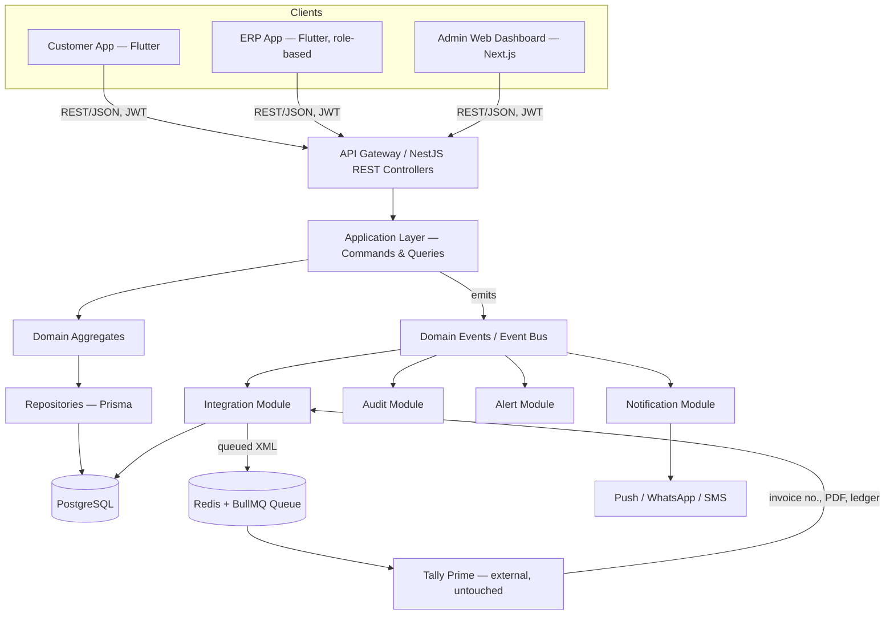

# PHASE 1 ROADMAP — FMCG ERP ("Order-to-Invoice Digitalization")

**Status:** Living build document. Every engineer joining this project reads this file first, in full, before touching code.

**Scope of this document:** everything needed to go from an empty repository to a working, demoable, client-pilot-ready Phase 1 system — digitizing Order → Approval → Dispatch → Invoice (Tally) → Delivery → Payment, without replacing Tally.

**Relationship to the other docs in `/docs`:** those files are the *design history* — how we arrived at these decisions (business flow, business objects, lifecycle, aggregates, events, state machines, use cases, database schema). This file is the *build plan* — what we actually type, in what order, in what folder, using what stack. If this document and an older design doc ever disagree, this document wins for "what to build now"; the design docs win for "why it works this way."

---

## 1. Glossary — Read This First

If you're new to enterprise/DDD-style backends, these terms appear constantly in this doc and in code comments. Learn them once here.

| Term | Plain-English meaning |
|---|---|
| **Domain** | A slice of the business that owns one responsibility (Sales, Warehouse, Accounting...). Maps to one top-level backend module and one database schema section. |
| **Aggregate / Aggregate Root** | A cluster of tables that must change together, guarded by one entry point. E.g. `Order` + `OrderItems` + `OrderRevisions` are one aggregate; you never touch `OrderItems` except through the `Order` aggregate root. |
| **Command** | A request to *change* something (`PlaceOrder`, `ApproveOrder`). Named as an imperative verb + noun, past-tense-free. |
| **Query** | A request to *read* something (`GetOrder`, `GetPendingOrders`). Never changes data. |
| **Event** | A fact that already happened (`OrderPlaced`, `OrderApproved`), emitted *after* a command succeeds. Named in past tense. Other modules subscribe to events instead of being called directly. |
| **Application Service / Use Case** | The actual class that executes one Command or Query. One file per use case, not one giant service class. |
| **CQRS** | Command Query Responsibility Segregation — writes and reads go through physically separate code paths, even though they hit the same database. |
| **DDD** | Domain-Driven Design — organizing code around business concepts (Order, Dispatch) instead of technical layers (Controllers, Services) as the primary structure. |
| **Read Model / Snapshot** | Data we store locally that is *owned* by another system (e.g. `customer_credit_snapshot` is owned by Tally/Accounting; our Customer domain only reads it). |
| **Idempotent** | Doing the same operation twice has the same effect as doing it once. Required for anything that talks to Tally or a queue, since retries will happen. |
| **Source of truth** | Whoever's data wins in a disagreement. Phase 1: Tally is source of truth for Inventory/Ledger/Invoice. Our DB is source of truth for Order/Dispatch/Customer profile. |

---

## 2. Architecture Overview

### 2.1 The business flow this system implements

```
Customer/Salesman ──▶ Order ──▶ Approval ──▶ Trip (Planning) ──▶ Dispatch (Warehouse)
                                                                        │
                                                                        ▼
                                                     Invoice (generated INTO Tally)
                                                                        │
                                                                        ▼
                                                             Delivery ──▶ Payment
```

Every arrow above is an **event boundary** — the object on the right is *created* by an event from the object on the left. Nothing is edited in place across a boundary. Full rationale: `docs/seventh_chat_bussiness_object_lifecycle.md` and `docs/eight_chat_aggregate_boundries_and_ownership.md`.

### 2.2 System / network architecture



**Read this diagram like a rulebook, not just a picture:**
- Clients never call the database, Tally, or the queue directly — only the Gateway.
- Only the **Integration module** is allowed to know Tally exists. If you ever find Tally XML code inside `sales/` or `warehouse/`, that's a bug in the architecture, not a shortcut.
- Notification/Audit/Alert never get called directly by another domain's code — they **listen** to events. This is what lets us add "send WhatsApp after invoice" later without touching the Invoice code at all.

### 2.3 The three client surfaces (and why three, not one or five)

| Surface | Stack | Who uses it | Why separate |
|---|---|---|---|
| **Customer App** | Flutter | Retailers/shopkeepers ordering stock | Different trust boundary (external users), different UX (shopping-app feel) |
| **ERP App** | Flutter, single codebase, role-based UI | Salesman, Warehouse Supervisor, Loader, Driver, Cashier | Same login/permission system; screen shown depends on `auth_roles`/`auth_permissions`, not a separate build per role |
| **Admin Web Dashboard** | Next.js + TypeScript | Admin, Accountant, Sales Manager | Desktop-heavy workflows (approvals queues, reports, invoice review, product management) are painful on mobile; web is faster to build data-grid-heavy screens |

All three talk to **the same backend**, the same auth token format, the same permission model. There is exactly one backend, never one-per-app.

---

## 3. Tech Stack — What and Why

| Layer | Choice | Why (not just "because it's popular") |
|---|---|---|
| Backend framework | **NestJS (TypeScript)** | Built-in DI, module system, and decorators map directly onto our Domain/Application/Infrastructure/Presentation folder structure — the framework doesn't fight the architecture. |
| ORM | **Prisma** | Type-safe queries generated from schema; migrations are reviewable diffs; matches our `complete_database_schema.md` table-by-table almost 1:1. |
| Database | **PostgreSQL** | ACID transactions (critical — an Order approval and its timeline row must commit together), JSONB for audit payloads, mature indexing for reports. |
| Cache / Queue | **Redis + BullMQ** | Same technology serves OTP storage, session cache, rate limiting, *and* the Tally sync queue with retry/backoff — one moving part instead of three. |
| Realtime | **Socket.IO** | Order status, dispatch progress, trip updates pushed live to dashboards without polling. |
| File storage | **S3-compatible bucket** | Invoice PDFs, delivery photos/signatures, product images. |
| Mobile | **Flutter** | Single codebase for Android + iOS, strong offline story (needed for warehouse/driver use in poor connectivity). |
| Mobile local storage (offline-first) | **Drift (SQLite)** | Salesman/Driver/Loader apps must keep working with no signal; Drift gives typed local queries that mirror the server schema. |
| Admin Web | **Next.js + TypeScript + Tailwind + TanStack Query + AG Grid + React Hook Form + Zod** | Server-rendered where useful, TanStack Query for API cache/sync, AG Grid for the heavy tables (orders, dispatch, invoices), Zod for the same validation shapes on client and server. |
| API contract validation | **class-validator / class-transformer (backend)**, **Zod (frontend)** | Every DTO validated at the boundary — nothing "trusted" from the client, per the Security principle in the roadmap docs. |
| Auth tokens | **JWT (access) + refresh token rotation** | Matches `auth_sessions` / `auth_refresh_tokens` schema already designed. |
| Container/local dev | **Docker Compose** (Postgres, Redis, MinIO for local S3) | One command spins up every dependency identically on every machine. |
| CI | **GitHub Actions** | Lint, typecheck, unit tests, build — on every PR. |
| Monorepo tooling | **Turborepo (or Nx)** | Shared TypeScript types (`packages/shared-types`) between backend DTOs and the Next.js admin app, without publishing a private npm package. |

---

## 4. Repository Structure

```
fmcg-erp/
├── apps/
│   ├── backend/                       # NestJS API — the only thing touching the DB and Tally
│   │   ├── src/
│   │   │   ├── modules/
│   │   │   │   ├── auth/
│   │   │   │   ├── customer/
│   │   │   │   ├── catalog/
│   │   │   │   ├── sales/
│   │   │   │   ├── planning/
│   │   │   │   ├── warehouse/
│   │   │   │   ├── accounting/
│   │   │   │   ├── delivery/
│   │   │   │   ├── payment/
│   │   │   │   ├── notification/
│   │   │   │   ├── audit/
│   │   │   │   ├── alert/
│   │   │   │   └── integration/
│   │   │   │       └── tally/
│   │   │   ├── shared/                # cross-cutting: guards, decorators, filters, pipes
│   │   │   ├── common/                # generic helpers (pagination, date utils)
│   │   │   ├── event-bus/             # event emitter/subscriber wiring
│   │   │   ├── prisma/                # PrismaService, schema.prisma
│   │   │   └── main.ts
│   │   └── test/
│   │
│   ├── admin-web/                     # Next.js — Admin, Accountant, Sales Manager
│   ├── erp-mobile/                    # Flutter — Salesman/Warehouse/Driver/Cashier, role-based
│   └── customer-app/                  # Flutter — customer ordering
│
├── packages/
│   ├── shared-types/                  # DTOs & enums shared between backend and admin-web
│   └── config/                        # eslint, tsconfig, prettier presets shared across apps
│
├── infra/
│   ├── docker-compose.yml             # postgres, redis, minio
│   └── github-actions/
│
├── docs/                              # this file lives here, alongside every design doc
└── turbo.json / nx.json
```

### 4.1 Inside every backend domain module (identical shape, always)

```
sales/
├── presentation/
│   ├── controllers/
│   │   └── order.controller.ts        # thin — only maps HTTP → command/query, no business logic
│   └── dto/
│       └── place-order.dto.ts
├── application/
│   ├── commands/
│   │   ├── place-order/
│   │   │   ├── place-order.command.ts
│   │   │   ├── place-order.handler.ts
│   │   │   ├── place-order.validator.ts
│   │   │   └── place-order.spec.ts
│   │   ├── approve-order/
│   │   ├── request-order-change/
│   │   └── ...
│   └── queries/
│       ├── get-order/
│       ├── get-pending-orders/
│       └── ...
├── domain/
│   ├── aggregates/
│   │   └── order.aggregate.ts
│   ├── entities/
│   ├── events/
│   │   ├── order-placed.event.ts
│   │   └── order-approved.event.ts
│   ├── value-objects/
│   └── repositories/
│       └── order.repository.interface.ts   # interface only — no Prisma import here
├── infrastructure/
│   ├── repositories/
│   │   └── order.repository.ts             # Prisma implementation of the interface above
│   └── event-handlers/
│       └── on-order-placed.handler.ts
└── sales.module.ts
```

**Why this exact shape, explained simply:**
- `domain/` never imports Prisma or NestJS decorators — it's pure business logic, testable with zero infrastructure running.
- `application/` orchestrates: load aggregate → call domain logic → save → emit event. One folder per use case keeps each file small enough to review in two minutes.
- `infrastructure/` is the only place that knows *how* data is actually stored — swапping Prisma for something else later never touches `domain/` or `application/`.
- `presentation/` is intentionally "dumb" — a controller method should almost always be 3–5 lines: validate input, dispatch command/query, return response.

This exact structure is created **once**, for Auth, in Sprint 1 — and copy-pasted (folder skeleton) for every subsequent domain, so nobody has to redesign it per module.

---

## 5. Coding Standards & Conventions

- **Naming:** Commands are imperative (`PlaceOrder`, `ApproveOrder`). Events are past-tense (`OrderPlaced`, `OrderApproved`). Queries start with `Get`/`Search`/`List`.
- **DTO validation:** every controller input is a `class-validator`-decorated DTO. No raw `req.body` access, ever.
- **No fat services:** if a handler file exceeds ~150 lines, it's doing too much — extract a domain method.
- **Never trust the client:** price, discount, GST, credit limit, and stock warnings are always recalculated server-side, even if the client sends them (matches the Security principle from `roadmap_from_first_chat.md`).
- **Every mutation emits an event**, even if nothing subscribes yet. Cheap now, expensive to retrofit later.
- **Audit is automatic, not manual:** a NestJS interceptor writes to `audit_logs` for every command handler — individual handlers never call "log this" themselves.
- **API versioning:** all routes under `/api/v1/...` from day one.
- **Endpoint classification:** every new route is tagged as Public / Internal / Webhook per `13_chat_api_by_domain_usecase.md`; Internal and Webhook routes are network-isolated (not reachable from mobile/web at all, enforced at the gateway).
- **Branching:** `main` protected; feature branches `feat/<domain>-<usecase>` (e.g. `feat/sales-place-order`); PR required, CI must pass, one reviewer minimum.
- **Commits:** Conventional Commits (`feat(sales): add PlaceOrder command`, `fix(warehouse): correct dispatch qty rounding`).
- **Definition of Done for any use case:** handler + validator + unit test + at least one integration test hitting a real (test) Postgres + Swagger doc annotation + reviewed PR merged.

---

## 6. Local Environment Setup (Sprint 0)

1. `docker compose up -d` in `infra/` → Postgres, Redis, MinIO running locally.
2. `apps/backend`: `npx prisma migrate dev` against the Auth Domain schema (first migration only).
3. `apps/backend`: `npm run start:dev` → Swagger available at `/api/docs`.
4. `apps/admin-web`: `npm run dev` → confirms it can hit `/api/v1/health`.
5. `apps/erp-mobile` and `apps/customer-app`: `flutter run` against local backend, confirming a "hello" screen loads.
6. GitHub Actions: lint + build passes on an empty PR.

**Definition of Done for Sprint 0:** a new engineer can clone the repo, run one command, and have all four apps talking to a local backend within 30 minutes, with nothing hardcoded to your machine.

---

## 7. Phase 1 — Sprint-by-Sprint Build Plan

Each sprint is a **vertical slice**: schema → backend use cases → at least one screen → a demoable checkpoint. Sprints are ordered by dependency, matching the foreign-key chain in `complete_database_schema.md` — you cannot build Sales before Catalog exists, and you cannot build Warehouse before Planning exists.

### Sprint 1 — Auth Domain (foundation everything else depends on)

| | |
|---|---|
| **Goal** | Any internal user can log in with OTP, gets a role, and the app knows what they're allowed to do. |
| **DB tables** | `auth_users`, `auth_roles`, `auth_permissions`, `auth_role_permissions`, `auth_user_roles`, `auth_sessions`, `auth_devices`, `auth_otps`, `auth_refresh_tokens`, `auth_login_history` |
| **Use cases (backend)** | `LoginWithOTP`, `VerifyOTP`, `RefreshAccessToken`, `Logout`, `LogoutAllDevices`, `RegisterEmployee`, `ActivateUser`/`DeactivateUser`, `CreateRole`, `AssignPermission`, `GetUserPermissions` |
| **Endpoints** | `POST /auth/send-otp`, `POST /auth/verify-otp`, `POST /auth/refresh-token`, `POST /auth/logout`, `GET /auth/profile`, `POST /users`, `GET /roles`, `POST /roles/{id}/permissions` |
| **Cross-cutting built here** | `@RequirePermission()` guard/decorator, JWT strategy, audit interceptor — every later domain reuses these without rebuilding them |
| **Frontend** | Admin Web: login screen + "who am I" panel. ERP Mobile: login screen only (shell). |
| **Seed data** | Roles (`ADMIN`, `SALESMAN`, `WAREHOUSE_SUPERVISOR`, `LOADER`, `ACCOUNTANT`, `DRIVER`, `CASHIER`), and the full granular permission list (`order.create`, `order.approve`, `dispatch.edit`, `invoice.generate`, ...). |
| **Demo checkpoint** | Log in as Admin on web, log in as Salesman on the ERP mobile shell — each sees a different (even if empty) home screen based on role. |
| **What you're learning here** | This is the sprint where the DDD folder structure and the Command/Event pattern get built for real, for the first time. Every later domain is a copy of this shape. |

### Sprint 2 — Catalog Domain

| | |
|---|---|
| **Goal** | Real products exist with real prices, ready to be ordered. |
| **DB tables** | `catalog_categories`, `catalog_companies`, `catalog_brands`, `catalog_products`, `catalog_product_skus`, `catalog_product_packings`, `catalog_price_lists`, `catalog_product_prices`, `catalog_product_images`, `catalog_product_barcodes`, `catalog_product_taxes` |
| **Use cases** | `CreateCategory`, `CreateCompany`, `CreateBrand`, `CreateProduct`, `CreateSKU`, `AddPacking`, `AssignPrice`, `UploadProductImage`, `GetProductCatalog`, `SearchProducts` |
| **Endpoints** | `/categories`, `/companies`, `/brands`, `/products`, `/products/{id}/sku`, `/sku/{id}/prices`, `/catalog`, `/catalog/search` |
| **Frontend** | Admin Web: full product management (create Company → Brand → Product → SKU → Price, with image upload). |
| **Demo checkpoint** | Admin builds the client's actual product catalogue — e.g. real Parle/Coca-Cola SKUs with real packing and pricing — end to end in the dashboard. |
| **Learning note** | This sprint has no workflow/state machine risk — it's the safe place to get comfortable with the Command/Query split before Sales gets complicated. |

### Sprint 3 — Customer Domain

| | |
|---|---|
| **Goal** | Real customers exist, assigned to a salesman, able to log in on the phone. |
| **DB tables** | `customer_customers`, `customer_auth`, `customer_addresses`, `customer_contacts`, `customer_salesmen`, `customer_settings`, `customer_documents`, `customer_activity` (leave `customer_credit_snapshot`/`customer_ledger_mapping` as empty stub tables — Integration isn't built yet) |
| **Use cases** | `RegisterCustomer`, `UpdateCustomerProfile`, `AssignSalesman`, `CustomerLogin`, `VerifyCustomerOTP`, `AddContact`, `UploadDocument` |
| **Endpoints** | `/customers`, `/customers/{id}/addresses`, `/customers/{id}/assign-salesman`, `/customer/auth/send-otp`, `/customer/auth/verify-otp` |
| **Frontend** | Admin Web: customer management. Customer App: OTP login screen only (real, working). |
| **Demo checkpoint** | Admin registers a real customer, assigns a real salesman, and that customer logs into the phone app with their real mobile number. |

### Sprint 4 — Sales Domain, Part A: Placing Orders

| | |
|---|---|
| **Goal** | A real customer places a real order against the real catalogue. |
| **DB tables** | `sales_orders`, `sales_order_items`, `sales_order_revisions`, `sales_order_timeline` |
| **Use cases** | `PlaceOrder`, `GetOrder`, `GetOrders`, `GetCustomerOrders` |
| **Endpoints** | `POST /orders`, `GET /orders`, `GET /orders/{id}` |
| **Frontend** | Customer App: browse catalog → cart → place order (this is the phone screen shown in the architecture diagram). ERP Mobile: Salesman sees "My Customers' Orders" list. |
| **Business rule enforced here** | No stock validation (Tally owns stock) — only customer-active, SKU-active, price-available checks. Credit check produces an alert, never a rejection. |
| **Demo checkpoint** | Full round trip: customer taps "Place Order" on the phone → order appears instantly in the salesman's list. |

### Sprint 5 — Sales Domain, Part B: Approval & Order Changes

| | |
|---|---|
| **Goal** | The trickiest business logic in the system — approve orders, and support post-approval edits without ever losing history. |
| **DB tables** | `sales_approvals`, `sales_order_changes`, `sales_order_change_items` |
| **Use cases** | `ApproveOrder`, `RejectOrder`, `RequestOrderChange`, `ApproveOrderChange`, `RejectOrderChange` |
| **Endpoints** | `/orders/{id}/approve`, `/orders/{id}/reject`, `/orders/{id}/request-change`, `/orders/{id}/approve-change` |
| **Frontend** | Admin Web / ERP Mobile: approval queue screen; "request change" flow on an approved order. |
| **Alert wiring starts here** | `alert_types`, `alert_alerts`, `alert_recipients` built now, minimally — credit-limit-exceeded alert is the first real alert in the system. |
| **Demo checkpoint** | Salesman approves an order; a day later, requests a change (add 5 cartons); Admin approves the change; the order's revision history shows both versions, unmodified. |
| **Learning note** | This is where "objects create the next object, never overwrite" stops being theory and becomes a test you write: assert the old revision row is untouched after a change is applied. |

### Sprint 6 — Planning Domain

| | |
|---|---|
| **Goal** | Approved orders get scheduled onto a real vehicle and route. |
| **DB tables** | `planning_vehicles`, `planning_drivers`, `planning_routes`, `planning_trips`, `planning_trip_orders`, `planning_trip_status_history` |
| **Use cases** | `CreateTrip`, `AssignVehicle`, `AssignDriver`, `AssignOrderToTrip`, `LockTrip`, `GetTrips` |
| **Endpoints** | `/trips`, `/trips/{id}/assign-vehicle`, `/trips/{id}/assign-driver`, `/trips/{id}/assign-order` |
| **Frontend** | Admin Web: dispatcher's trip-planning board (approved orders queue → drag onto a trip). |
| **Demo checkpoint** | Dispatcher creates a real trip, assigns a real vehicle/driver, and attaches this week's approved orders to it. |

### Sprint 7 — Warehouse Domain

| | |
|---|---|
| **Goal** | A trip's orders get physically loaded, with real quantity differences captured. |
| **DB tables** | `warehouse_dispatches`, `warehouse_dispatch_items`, `warehouse_dispatch_change_requests`, `warehouse_dispatch_change_request_items`, `warehouse_loading_history`, `warehouse_dispatch_timeline` |
| **Use cases** | `CreateDispatch`, `StartLoading`, `UpdateLoadedQuantity`, `ReplaceItem`, `MarkUnavailable`, `CompleteLoading` |
| **Endpoints** | `/dispatch`, `/dispatch/{id}/start-loading`, `/dispatch-items/{id}`, `/dispatch/{id}/complete-loading` |
| **Frontend** | ERP Mobile: Loading Supervisor screen — ordered qty vs. loaded qty side by side, reason codes for shortfalls. |
| **Demo checkpoint** | Warehouse loads a real dispatch with at least one deliberate shortfall (e.g. ordered 10, loaded 8, reason "Out of Stock") and locks it. |
| **This is the highest-stakes checkpoint before Tally**, since whatever the Dispatch says becomes the invoice — verify the numbers by hand once here. |

### Sprint 8 — Integration Domain + Accounting Domain (built together)

| | |
|---|---|
| **Goal** | One click turns a locked dispatch into a real Tally invoice. |
| **DB tables** | `integration_tally_sync_queue`, `integration_tally_sync_log`, `integration_tally_mapping`, `integration_tally_config`, `accounting_invoice_references`, `accounting_invoice_items` |
| **Use cases** | `GenerateInvoiceRequest`, `SyncInvoice`, `RetryInvoiceSync`, `ProcessSyncQueue` |
| **Endpoints** | `/invoice/generate`, `/invoice/{id}`, `/invoice/{id}/retry-sync`, internal-only `/internal/sync/invoice` |
| **De-risking step (do this before wiring the queue)** | Write a small standalone script that sends one hard-coded XML request to a real Tally instance and confirms an invoice appears. Only once that works do you wire it into the BullMQ queue with retry/backoff. |
| **Frontend** | Admin Web: Accountant's "Generate Invoice" screen, showing dispatch review + one button. |
| **Demo checkpoint** | **This is the Phase 1 headline milestone.** Accountant clicks Generate Invoice on the dispatch from Sprint 7 → real invoice appears in Tally → invoice number and PDF sync back and are visible in the customer's app. |

### Sprint 9 — Delivery + Payment Domains

| | |
|---|---|
| **Goal** | Close the loop: goods delivered, money collected and verified. |
| **DB tables** | `delivery_deliveries`, `delivery_proof`, `delivery_status_history`, `payment_payments`, `payment_allocations`, `payment_receipts`, `payment_verifications` |
| **Use cases** | `StartDelivery`, `CompleteDelivery`, `PartialDelivery`, `UploadSignature`, `CollectCash`/`CollectUPI`, `VerifyCollection`, `AllocatePayment` |
| **Endpoints** | `/delivery/{id}/start`, `/delivery/{id}/delivered`, `/payments/cash`, `/payments/{id}/verify` |
| **Frontend** | ERP Mobile: Driver screen (mark delivered, capture signature/photo), Cashier screen (verify collection). |
| **Demo checkpoint** | Full order-to-cash loop for one real customer: place order → approve → plan → load → invoice → deliver → collect → verify. This is the complete Phase 1 story, start to finish, on real devices. |

### Sprint 10 — Notification, Audit, Alert hardening pass

| | |
|---|---|
| **Goal** | No new business features — wire the cross-cutting modules onto every event already flowing from Sprints 1–9. |
| **Tasks** | Notification templates + real push/WhatsApp/SMS sending on `OrderApproved`, `InvoiceGenerated`, `DeliveryCompleted`; confirm the audit interceptor is capturing every command handler; confirm alerts fire and are visible on the right dashboards. |
| **Demo checkpoint** | Every major event in the Sprint 9 walkthrough now also produces a real notification and a real audit trail entry, provably (show the `audit_logs` rows for that one order). |

### Sprint 11 — Client Pilot

| | |
|---|---|
| **Goal** | Run the system in parallel with Tally for 1–2 real customers/salesmen before any wider rollout. |
| **Tasks** | Onboard real data for the pilot customers, shadow the existing manual process alongside the app for a full order cycle, fix whatever breaks against real-world messiness. |
| **Exit criteria for Phase 1** | The pilot customer's full order cycle completes through the app with an accountant confirming the Tally invoice matches reality, with no manual double-entry required. |

---

## 8. Definition of Done — Phase 1

Phase 1 is complete when all of the following are simultaneously true:

- [ ] A customer can log in, browse the real catalogue, and place a real order on the Customer App.
- [ ] A salesman can approve it (or request/approve a change) on the ERP Mobile app.
- [ ] A dispatcher can plan a trip and assign it a real vehicle/driver.
- [ ] A warehouse supervisor can load it, with quantity differences captured and reasoned.
- [ ] An accountant can generate a real Tally invoice with one click, with the invoice number and PDF syncing back to the customer.
- [ ] A driver can mark it delivered with proof captured.
- [ ] A cashier can collect and verify payment, and it posts back to the Tally ledger.
- [ ] Every step above produced the correct notification and a complete audit trail.
- [ ] At least one pilot customer has run a real order cycle this way, side-by-side with Tally, without discrepancy.

## 9. Explicitly Out of Scope for Phase 1

(So nobody accidentally starts building these early — they belong to later phases per `roadmap_from_first_chat.md`.)

- Inventory Domain (live stock, batch, expiry) — Phase 2–4.
- Purchase Domain (supplier management, PO, receiving) — Phase 5.
- Full in-house Accounting/Ledger engine replacing Tally — Phase 6, optional.
- AI Domain (demand forecasting, reorder suggestions) — after Phase 1 data has accumulated.

---

## 10. Reference Index

| Question | Doc |
|---|---|
| Why does this business rule exist? | `nineth_chat_bussiness_rules_doc.md` |
| What's the full table/column list? | `database_docs/complete_database_schema.md` |
| What's the exact API endpoint for X? | `13_chat_api_by_domain_usecase.md` |
| What's the state machine for Order/Trip/Dispatch/Delivery? | `last_couple_of_chat.md` |
| What does the client-facing pitch look like? | Architecture diagram artifact (shared separately) |

This document is the one place that turns all of the above into an actual, ordered, buildable plan. When in doubt about *what to build next*, this is the file to open.
