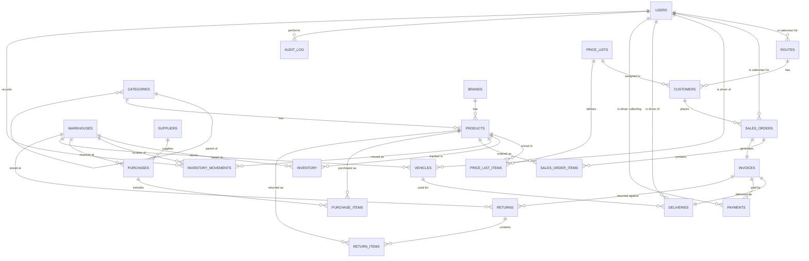

# Distribution Management System — Database Schema Documentation (v2)

A complete developer reference for the database, **updated with the recommended design
decisions applied**. This is a **B2B wholesale / distribution system** for the Indian market
(GST, PIN codes, UPI payments, Tally accounting sync). It covers the full business flow:
managing products and stock, taking orders from customer shops, invoicing, delivering by van,
collecting payments, buying stock from suppliers, and handling returns.

Use this document as your reference while building. Everything below reflects the schema **after**
the improvements — every table, column, data type, constraint, and relationship.

---

## 0. What Changed in v2 (Review This for Your Requirements Doc)

These are the concrete changes applied compared to the original schema. Confirm each one.

1. **UUID v7 for all IDs.** Time-ordered UUIDs, generated client-side, stored as a native
   `uuid`/binary type (not text). Keeps offline-sync friendliness without hurting index
   performance.
2. **Full audit timestamps on every table.** Every table now has `created_at` and `updated_at`.
3. **`created_by` / `updated_by` on transactional tables.** Orders, invoices, deliveries,
   payments, purchases, returns (and their line items) now record which user performed the
   action → `USERS.id`.
4. **GST split into CGST / SGST / IGST.** The single `gst` column is replaced with `cgst`,
   `sgst`, and `igst` on all order/invoice/purchase headers and line items. Line items also
   snapshot the `gst_rate` used. Invoices gain `place_of_supply` and `round_off`.
5. **New `INVENTORY_MOVEMENTS` ledger.** Every stock change is now recorded as a movement row.
   The `INVENTORY` counters become a fast summary that can be rebuilt from the ledger.
6. **File-path storage for images/signatures.** `customer_signature`, `image`, `logo`, and
   `photo` now explicitly store a **path/URL to object storage**, not base64 in the database.
7. **Soft deletes.** Transactional and master tables gain a nullable `deleted_at`. Unique
   constraints become **partial** (apply only to non-deleted rows).
8. **New `AUDIT_LOG` table.** A general who-did-what trail across the system.
9. **Indexing strategy** documented in Section 8 (all FKs, all UQ columns, plus targeted
   composite indexes).

---

## 1. How to Read This Document

### Constraint tags

| Tag | Meaning |
|-----|---------|
| **PK** | Primary Key — the unique ID for each row in the table. |
| **FK** | Foreign Key — points to the `id` of a row in another table (this is how tables link together). |
| **UQ** | Unique — no two rows can have the same value. In v2 these are **partial unique** (ignore soft-deleted rows). |
| **NOT_NULL** | This column must always have a value; it cannot be left empty. |
| **NULL** | This column is optional; it can be left empty. |
| **Composite** | A rule made from more than one column combined together. |

### Data types

| Type | Meaning |
|------|---------|
| **Uuid** | A **UUID v7** unique ID, generated client-side, stored as native `uuid`/binary. |
| **Varchar(n)** | Text with a maximum length of `n` characters. |
| **Text** | Long text with no fixed length limit (addresses, notes). |
| **Integer** | A whole number (no decimals). |
| **Decimal(p,s)** | A number with decimals. `p` = total digits, `s` = digits after the point. `Decimal(12,2)` holds money up to ~10 billion with paise. |
| **Boolean** | True/false. |
| **Timestamp** | A date **and** time. |
| **Enum** | A value from a fixed list — see Section 6. |
| **JSON** | Structured data stored as JSON (used by the audit log). |

### Conventions applied everywhere (v2)

- **`id`** is a UUID v7 primary key on every table.
- **`created_at`** and **`updated_at`** (both `NOT_NULL`, `Timestamp`) exist on every table.
  `created_at` defaults to now; `updated_at` auto-updates on every change.
- **`deleted_at`** (`NULL`, `Timestamp`) exists on the tables marked "soft-delete" below. A
  non-null value means the row is logically deleted and should be hidden from normal queries.
- **`created_by` / `updated_by`** (`FK`, `NULL`, → `USERS.id`) exist on transactional tables.
- **Money** uses `Decimal(12,2)`; **GST rate** uses `Decimal(5,2)`; **GPS** uses
  `Decimal(10,7)`. Never use floating point for money.
- **Files** (images, logos, photos, signatures) store a **path or URL** to object storage.

> To keep the tables below readable, the always-present audit columns (`created_at`,
> `updated_at`, and where applicable `deleted_at`, `created_by`, `updated_by`) are listed once
> here and **not repeated in every table** unless a table already tracked them. Each table
> header states which of these apply.

---

## 2. The Big Picture (What Connects to What)

Four main areas work together:

1. **Setup / master data** — users, routes, customers, categories, brands, products, price
   lists, warehouses, suppliers, vehicles.
2. **Selling** — Order → Invoice → Delivery → Payment (the core flow).
3. **Buying** — purchases from suppliers into warehouses.
4. **Returns** — goods coming back from customers.
5. **Cross-cutting** — the inventory ledger and the audit log record *what happened* across all
   of the above.

> `||--o{` = one-to-many. `||--||` = one-to-one (`SALES_ORDERS→INVOICES` and
> `INVOICES→DELIVERIES` remain one-to-one via a unique FK).

---

## 3. Table Reference (Full Detail, v2)

For each table, the header lists which audit columns apply. Those columns are **not** repeated
inside the table unless the original schema already had them.

### 3.1 Setup / Master Data

#### USERS
*Audit columns: already has `created_at`, `updated_at`. Adds `deleted_at` (soft-delete).*
All staff. The `role` column decides whether someone is a salesman, driver, admin, etc.

| Column | Constraint | Type | Description |
|--------|-----------|------|-------------|
| id | PK | Uuid | Unique ID for the user. |
| full_name | NOT_NULL | Varchar(150) | The person's full name. |
| mobile | UQ, NOT_NULL | Varchar(20) | Mobile number; unique (often the login). |
| email | UQ, NOT_NULL | Varchar(150) | Email; unique. |
| password_hash | NOT_NULL | Varchar(255) | Encrypted password (never plain text). |
| role | NOT_NULL | Enum | Role: salesman, driver, admin, etc. |
| status | NOT_NULL | Enum | Active / inactive. |
| created_at | NOT_NULL | Timestamp | When the account was created. |
| updated_at | NOT_NULL | Timestamp | When it was last changed. |
| deleted_at | NULL | Timestamp | Soft-delete marker. |

#### ROUTES
*Audit columns added: `created_at`, `updated_at`, `deleted_at`.*

| Column | Constraint | Type | Description |
|--------|-----------|------|-------------|
| id | PK | Uuid | Unique ID for the route. |
| name | NOT_NULL | Varchar(150) | Route name. |
| salesman_id | FK | Uuid | Assigned salesman → `USERS.id`. |
| status | NOT_NULL | Enum | Active / inactive. |

#### CUSTOMERS
*Audit columns: already has `created_at`. Adds `updated_at`, `deleted_at`.*

| Column | Constraint | Type | Description |
|--------|-----------|------|-------------|
| id | PK | Uuid | Unique ID for the customer. |
| customer_code | UQ, NOT_NULL | Varchar(50) | Short unique shop code. |
| business_name | NOT_NULL | Varchar(200) | Shop / business name. |
| owner_name | NOT_NULL | Varchar(150) | Owner / contact name. |
| mobile | NOT_NULL | Varchar(20) | Primary mobile. |
| alternate_mobile | NULL | Varchar(20) | Optional second mobile. |
| gst_number | NULL | Varchar(30) | GST number (optional). |
| address | NOT_NULL | Text | Full address. |
| city | NOT_NULL | Varchar(100) | City. |
| state | NOT_NULL | Varchar(100) | State (used to decide interstate GST). |
| pincode | NOT_NULL | Varchar(15) | PIN code. |
| credit_limit | NOT_NULL | Decimal(12,2) | Max outstanding credit allowed. |
| payment_terms | NOT_NULL | Integer | Credit period in days. |
| route_id | FK | Uuid | Route → `ROUTES.id`. |
| price_list_id | FK | Uuid | Price list → `PRICE_LISTS.id`. |
| status | NOT_NULL | Enum | Active / inactive / blocked. |
| created_at | NOT_NULL | Timestamp | When added. |

#### PRICE_LISTS
*Audit columns added: `created_at`, `updated_at`, `deleted_at`.*

| Column | Constraint | Type | Description |
|--------|-----------|------|-------------|
| id | PK | Uuid | Unique ID. |
| name | NOT_NULL | Varchar(150) | Price list name. |
| description | NULL | Text | Optional notes. |

#### PRICE_LIST_ITEMS
*Audit columns added: `created_at`, `updated_at`.*
The price of one product within one price list.

| Column | Constraint | Type | Description |
|--------|-----------|------|-------------|
| id | PK | Uuid | Unique ID. |
| price_list_id | FK | Uuid | → `PRICE_LISTS.id`. |
| product_id | FK | Uuid | → `PRODUCTS.id`. |
| price | NOT_NULL | Decimal(12,2) | Special price for this product in this list. |
| *unique rule* | UQ (Composite) | — | `price_list_id` + `product_id` unique (one price per product per list). |

#### CATEGORIES
*Audit columns added: `created_at`, `updated_at`, `deleted_at`.* Self-referential via `parent_id`.

| Column | Constraint | Type | Description |
|--------|-----------|------|-------------|
| id | PK | Uuid | Unique ID. |
| name | NOT_NULL | Varchar(150) | Category name. |
| parent_id | FK, NULL | Uuid | Parent category → `CATEGORIES.id`. Empty = top level. |
| image | NULL | Varchar(255) | Path/URL to a category image. |

#### BRANDS
*Audit columns added: `created_at`, `updated_at`, `deleted_at`.*

| Column | Constraint | Type | Description |
|--------|-----------|------|-------------|
| id | PK | Uuid | Unique ID. |
| name | NOT_NULL | Varchar(150) | Brand name. |
| logo | NULL | Varchar(255) | Path/URL to the brand logo. |

#### PRODUCTS
*Audit columns added: `created_at`, `updated_at`, `deleted_at`.*

| Column | Constraint | Type | Description |
|--------|-----------|------|-------------|
| id | PK | Uuid | Unique ID. |
| sku | UQ, NOT_NULL | Varchar(80) | Unique internal product code. |
| barcode | UQ, NOT_NULL | Varchar(80) | Unique barcode. |
| name | NOT_NULL | Varchar(200) | Product name. |
| category_id | FK | Uuid | → `CATEGORIES.id`. |
| brand_id | FK | Uuid | → `BRANDS.id`. |
| unit | NOT_NULL | Varchar(50) | Selling unit (piece, kg, box). |
| packing | NOT_NULL | Varchar(50) | Packing (e.g. "12 x 500ml"). |
| mrp | NOT_NULL | Decimal(12,2) | Maximum Retail Price. |
| selling_price | NOT_NULL | Decimal(12,2) | Default selling price. |
| gst_rate | NOT_NULL | Decimal(5,2) | Current GST % (e.g. 18.00). |
| minimum_stock | NOT_NULL | Integer | Low-stock alert level. |
| image | NULL | Varchar(255) | Path/URL to a product image. |
| status | NOT_NULL | Enum | Active / inactive. |

#### WAREHOUSES
*Audit columns added: `created_at`, `updated_at`, `deleted_at`.*

| Column | Constraint | Type | Description |
|--------|-----------|------|-------------|
| id | PK | Uuid | Unique ID. |
| name | NOT_NULL | Varchar(150) | Warehouse name. |
| address | NOT_NULL | Text | Address. |
| state | NOT_NULL | Varchar(100) | **New:** warehouse state, used with customer state to decide CGST+SGST vs IGST. |
| status | NOT_NULL | Enum | Active / inactive. |

#### SUPPLIERS
*Audit columns added: `created_at`, `updated_at`, `deleted_at`.*

| Column | Constraint | Type | Description |
|--------|-----------|------|-------------|
| id | PK | Uuid | Unique ID. |
| supplier_code | UQ, NOT_NULL | Varchar(50) | Short unique supplier code. |
| name | NOT_NULL | Varchar(200) | Supplier name. |
| gst_number | NULL | Varchar(30) | GST number (optional). |
| mobile | NOT_NULL | Varchar(20) | Contact mobile. |
| address | NOT_NULL | Text | Address. |
| status | NOT_NULL | Enum | Active / inactive. |

#### VEHICLES
*Audit columns added: `created_at`, `updated_at`, `deleted_at`.*

| Column | Constraint | Type | Description |
|--------|-----------|------|-------------|
| id | PK | Uuid | Unique ID. |
| vehicle_number | UQ, NOT_NULL | Varchar(50) | Unique registration number. |
| driver_id | FK | Uuid | Assigned driver → `USERS.id`. |
| warehouse_id | FK | Uuid | Home warehouse → `WAREHOUSES.id`. |
| capacity | NOT_NULL | Decimal(12,2) | Load capacity. |
| status | NOT_NULL | Enum | Available / in-use / maintenance. |

---

### 3.2 Inventory

#### INVENTORY
*Audit columns: already has `updated_at`. Adds `created_at`.*
Live stock summary — one row per product per warehouse. In v2 these numbers are a **fast
summary** that can always be rebuilt from `INVENTORY_MOVEMENTS`.

| Column | Constraint | Type | Description |
|--------|-----------|------|-------------|
| id | PK | Uuid | Unique ID. |
| warehouse_id | FK | Uuid | → `WAREHOUSES.id`. |
| product_id | FK | Uuid | → `PRODUCTS.id`. |
| physical_stock | NOT_NULL | Integer | Actual units present. |
| reserved_stock | NOT_NULL | Integer | Units committed to orders, not yet shipped. |
| damaged_stock | NOT_NULL | Integer | Damaged / unsellable units. |
| expiry_stock | NOT_NULL | Integer | Expired / near-expiry units. |
| updated_at | NOT_NULL | Timestamp | Last update. |
| warehouse_product_unique | UQ (Composite) | — | `warehouse_id` + `product_id` unique (one row per product per warehouse). |

> **Sellable stock** = `physical_stock − reserved_stock − damaged_stock − expiry_stock`.

#### INVENTORY_MOVEMENTS  *(new in v2)*
*Audit columns: has `created_at`, `created_by`. This table is append-only — rows are never
updated or deleted.*
The stock ledger. Every change to inventory writes one row here. This gives you a full audit
trail, lets you reconcile when counters look wrong, and is essential for offline van sync.

| Column | Constraint | Type | Description |
|--------|-----------|------|-------------|
| id | PK | Uuid | Unique ID. |
| warehouse_id | FK | Uuid | → `WAREHOUSES.id`. |
| product_id | FK | Uuid | → `PRODUCTS.id`. |
| movement_type | NOT_NULL | Enum | What happened (purchase_in, reserved, unreserved, sold_out, returned_in, damaged, expired, adjustment, transfer_in, transfer_out). |
| quantity | NOT_NULL | Decimal(12,2) | Amount moved. Positive = stock in, negative = stock out (pick one convention and keep it). |
| reference_type | NULL | Varchar(50) | Source document type (sales_order, invoice, purchase, return, adjustment). |
| reference_id | NULL | Uuid | ID of the source document. |
| balance_after | NULL | Integer | Optional running physical balance after this movement. |
| remarks | NULL | Text | Optional note. |
| created_by | FK, NULL | Uuid | User who caused the movement → `USERS.id`. |
| created_at | NOT_NULL | Timestamp | When it happened. |

---

### 3.3 Selling Flow

#### SALES_ORDERS
*Audit columns added: `created_at`, `updated_at`, `deleted_at`, `created_by`, `updated_by`.*

| Column | Constraint | Type | Description |
|--------|-----------|------|-------------|
| id | PK | Uuid | Unique ID. |
| order_number | UQ, NOT_NULL | Varchar(80) | Unique order number. |
| customer_id | FK | Uuid | → `CUSTOMERS.id`. |
| salesman_id | FK | Uuid | → `USERS.id`. |
| order_date | NOT_NULL | Timestamp | When placed. |
| status | NOT_NULL | Enum | pending / approved / loaded / delivered / cancelled. |
| remarks | NULL | Text | Optional notes. |
| expected_delivery | NULL | Timestamp | Optional expected delivery. |
| subtotal | NOT_NULL | Decimal(12,2) | Before discount and tax. |
| discount | NOT_NULL | Decimal(12,2) | Total discount. |
| cgst | NOT_NULL | Decimal(12,2) | **New:** Central GST total. |
| sgst | NOT_NULL | Decimal(12,2) | **New:** State GST total. |
| igst | NOT_NULL | Decimal(12,2) | **New:** Integrated GST total (interstate). |
| round_off | NOT_NULL | Decimal(12,2) | **New:** Rounding adjustment. |
| total | NOT_NULL | Decimal(12,2) | Final payable amount. |

> Only **one** of (`cgst`+`sgst`) or (`igst`) is filled per order, decided by comparing the
> warehouse state and customer state.

#### SALES_ORDER_ITEMS
*Audit columns added: `created_at`, `updated_at`.*
Tracks three quantities (ordered / approved / loaded), reflecting the approval + van-loading
workflow.

| Column | Constraint | Type | Description |
|--------|-----------|------|-------------|
| id | PK | Uuid | Unique ID. |
| sales_order_id | FK | Uuid | → `SALES_ORDERS.id`. |
| product_id | FK | Uuid | → `PRODUCTS.id`. |
| ordered_qty | NOT_NULL | Decimal(12,2) | Quantity requested. |
| approved_qty | NOT_NULL | Decimal(12,2) | Quantity approved. |
| loaded_qty | NOT_NULL | Decimal(12,2) | Quantity loaded on the van. |
| price | NOT_NULL | Decimal(12,2) | Unit price for this line. |
| discount | NOT_NULL | Decimal(12,2) | Discount on this line. |
| gst_rate | NOT_NULL | Decimal(5,2) | **New:** GST % snapshot at time of sale. |
| cgst | NOT_NULL | Decimal(12,2) | **New:** Central GST for this line. |
| sgst | NOT_NULL | Decimal(12,2) | **New:** State GST for this line. |
| igst | NOT_NULL | Decimal(12,2) | **New:** Integrated GST for this line. |
| line_total | NOT_NULL | Decimal(12,2) | Final amount for this line. |

#### INVOICES
*Audit columns added: `created_at`, `updated_at`, `deleted_at`, `created_by`, `updated_by`.*
One order = one invoice.

| Column | Constraint | Type | Description |
|--------|-----------|------|-------------|
| id | PK | Uuid | Unique ID. |
| sales_order_id | UQ, FK | Uuid | → `SALES_ORDERS.id` (one-to-one). |
| invoice_number | UQ, NOT_NULL | Varchar(80) | Unique invoice number. |
| invoice_date | NOT_NULL | Timestamp | Invoice date/time. |
| place_of_supply | NOT_NULL | Varchar(100) | **New:** State of supply (required on GST invoices). |
| subtotal | NOT_NULL | Decimal(12,2) | Before discount and tax. |
| discount | NOT_NULL | Decimal(12,2) | Total discount. |
| cgst | NOT_NULL | Decimal(12,2) | **New:** Central GST total. |
| sgst | NOT_NULL | Decimal(12,2) | **New:** State GST total. |
| igst | NOT_NULL | Decimal(12,2) | **New:** Integrated GST total. |
| round_off | NOT_NULL | Decimal(12,2) | **New:** Rounding adjustment. |
| total | NOT_NULL | Decimal(12,2) | Final invoice amount. |
| payment_status | NOT_NULL | Enum | unpaid / partial / paid. |
| tally_sync_status | NOT_NULL | Enum | pending / synced / failed. |

#### DELIVERIES
*Audit columns added: `created_at`, `updated_at`, `created_by`, `updated_by`.*
One invoice = one delivery. Captures GPS, timings, and a signature.

| Column | Constraint | Type | Description |
|--------|-----------|------|-------------|
| id | PK | Uuid | Unique ID. |
| invoice_id | UQ, FK | Uuid | → `INVOICES.id` (one-to-one). |
| vehicle_id | FK | Uuid | → `VEHICLES.id`. |
| driver_id | FK | Uuid | → `USERS.id`. |
| status | NOT_NULL | Enum | pending / out_for_delivery / delivered / failed. |
| departure_time | NULL | Timestamp | Left the warehouse. |
| arrival_time | NULL | Timestamp | Reached the customer. |
| completion_time | NULL | Timestamp | Delivery completed. |
| latitude | NULL | Decimal(10,7) | GPS latitude at delivery. |
| longitude | NULL | Decimal(10,7) | GPS longitude at delivery. |
| customer_signature | NULL | Varchar(255) | **Changed:** path/URL to the signature image (was Text/base64). |
| remarks | NULL | Text | Optional notes. |

#### PAYMENTS
*Audit columns added: `created_at`, `updated_at`, `created_by`, `updated_by`.*

| Column | Constraint | Type | Description |
|--------|-----------|------|-------------|
| id | PK | Uuid | Unique ID. |
| invoice_id | FK | Uuid | → `INVOICES.id`. |
| driver_id | FK | Uuid | → `USERS.id`. |
| payment_date | NOT_NULL | Timestamp | When collected. |
| cash_amount | NOT_NULL | Decimal(12,2) | Paid in cash. |
| upi_amount | NOT_NULL | Decimal(12,2) | Paid via UPI. |
| cheque_amount | NOT_NULL | Decimal(12,2) | Paid by cheque. |
| total_amount | NOT_NULL | Decimal(12,2) | Sum of the three. |
| reference_number | NULL | Varchar(100) | UPI/cheque reference. |
| status | NOT_NULL | Enum | pending / cleared / bounced. |

> An invoice can have many payment rows (partial payments over time).

---

### 3.4 Buying Flow

#### PURCHASES
*Audit columns added: `created_at`, `updated_at`, `deleted_at`, `created_by`, `updated_by`.*

| Column | Constraint | Type | Description |
|--------|-----------|------|-------------|
| id | PK | Uuid | Unique ID. |
| supplier_id | FK | Uuid | → `SUPPLIERS.id`. |
| warehouse_id | FK | Uuid | → `WAREHOUSES.id`. |
| purchase_number | UQ, NOT_NULL | Varchar(80) | Unique purchase number. |
| purchase_date | NOT_NULL | Timestamp | When purchased. |
| status | NOT_NULL | Enum | draft / received / cancelled. |
| subtotal | NOT_NULL | Decimal(12,2) | Before tax. |
| cgst | NOT_NULL | Decimal(12,2) | **New:** Central GST total. |
| sgst | NOT_NULL | Decimal(12,2) | **New:** State GST total. |
| igst | NOT_NULL | Decimal(12,2) | **New:** Integrated GST total. |
| round_off | NOT_NULL | Decimal(12,2) | **New:** Rounding adjustment. |
| total | NOT_NULL | Decimal(12,2) | Final purchase amount. |

#### PURCHASE_ITEMS
*Audit columns added: `created_at`, `updated_at`.*

| Column | Constraint | Type | Description |
|--------|-----------|------|-------------|
| id | PK | Uuid | Unique ID. |
| purchase_id | FK | Uuid | → `PURCHASES.id`. |
| product_id | FK | Uuid | → `PRODUCTS.id`. |
| quantity | NOT_NULL | Decimal(12,2) | Quantity purchased. |
| purchase_price | NOT_NULL | Decimal(12,2) | Unit cost price. |
| gst_rate | NOT_NULL | Decimal(5,2) | **New:** GST % snapshot. |
| cgst | NOT_NULL | Decimal(12,2) | **New:** Central GST for this line. |
| sgst | NOT_NULL | Decimal(12,2) | **New:** State GST for this line. |
| igst | NOT_NULL | Decimal(12,2) | **New:** Integrated GST for this line. |
| total | NOT_NULL | Decimal(12,2) | Final amount for this line. |

---

### 3.5 Returns Flow

#### RETURNS
*Audit columns: already has `created_at`. Adds `updated_at`, `deleted_at`, `created_by`, `updated_by`.*

| Column | Constraint | Type | Description |
|--------|-----------|------|-------------|
| id | PK | Uuid | Unique ID. |
| invoice_id | FK | Uuid | → `INVOICES.id`. |
| warehouse_id | FK | Uuid | → `WAREHOUSES.id`. |
| reason | NOT_NULL | Enum | damaged / expired / wrong_item / not_needed. |
| remarks | NULL | Text | Optional notes. |
| photo | NULL | Varchar(255) | Path/URL to a photo of the goods. |
| status | NOT_NULL | Enum | requested / approved / completed / rejected. |
| created_at | NOT_NULL | Timestamp | When created. |

#### RETURN_ITEMS
*Audit columns added: `created_at`, `updated_at`.*

| Column | Constraint | Type | Description |
|--------|-----------|------|-------------|
| id | PK | Uuid | Unique ID. |
| return_id | FK | Uuid | → `RETURNS.id`. |
| product_id | FK | Uuid | → `PRODUCTS.id`. |
| quantity | NOT_NULL | Decimal(12,2) | Quantity returned. |
| reason | NOT_NULL | Varchar(255) | Free-text reason for this item. |

---

### 3.6 Cross-Cutting

#### AUDIT_LOG  *(new in v2)*
*Append-only. Has `created_at` only — rows are never updated or deleted.*
A general who-did-what trail. Write a row whenever an important action happens (create, update,
delete, approve, sync, etc.), especially on financial tables.

| Column | Constraint | Type | Description |
|--------|-----------|------|-------------|
| id | PK | Uuid | Unique ID. |
| user_id | FK, NULL | Uuid | Who performed the action → `USERS.id`. |
| action | NOT_NULL | Varchar(50) | create / update / delete / approve / sync / login, etc. |
| entity_type | NOT_NULL | Varchar(80) | The table/entity affected (e.g. "invoices"). |
| entity_id | NULL | Uuid | The affected row's ID. |
| old_values | NULL | JSON | Snapshot before the change. |
| new_values | NULL | JSON | Snapshot after the change. |
| ip_address | NULL | Varchar(45) | Origin IP (optional). |
| created_at | NOT_NULL | Timestamp | When it happened. |

---

## 4. All Relationships (Foreign Key Map, v2)

Read each line as **"child table.column points to parent table.id"**.

| From (child) | Column | To (parent) | Meaning |
|--------------|--------|-------------|---------|
| ROUTES | salesman_id | USERS | Each route has one salesman. |
| CUSTOMERS | route_id | ROUTES | Each customer is on one route. |
| CUSTOMERS | price_list_id | PRICE_LISTS | Each customer uses one price list. |
| PRICE_LIST_ITEMS | price_list_id | PRICE_LISTS | Each price row belongs to one price list. |
| PRICE_LIST_ITEMS | product_id | PRODUCTS | Each price row is for one product. |
| CATEGORIES | parent_id | CATEGORIES | A category can have a parent (nesting). |
| PRODUCTS | category_id | CATEGORIES | Each product has one category. |
| PRODUCTS | brand_id | BRANDS | Each product has one brand. |
| INVENTORY | warehouse_id | WAREHOUSES | Stock row belongs to one warehouse. |
| INVENTORY | product_id | PRODUCTS | Stock row is for one product. |
| INVENTORY_MOVEMENTS | warehouse_id | WAREHOUSES | Each movement is at one warehouse. |
| INVENTORY_MOVEMENTS | product_id | PRODUCTS | Each movement is for one product. |
| INVENTORY_MOVEMENTS | created_by | USERS | Who caused the movement. |
| SALES_ORDERS | customer_id | CUSTOMERS | Each order is from one customer. |
| SALES_ORDERS | salesman_id | USERS | Each order is taken by one salesman. |
| SALES_ORDER_ITEMS | sales_order_id | SALES_ORDERS | Each line belongs to one order. |
| SALES_ORDER_ITEMS | product_id | PRODUCTS | Each line is for one product. |
| INVOICES | sales_order_id | SALES_ORDERS | One invoice per order (one-to-one). |
| DELIVERIES | invoice_id | INVOICES | One delivery per invoice (one-to-one). |
| DELIVERIES | vehicle_id | VEHICLES | Each delivery uses one vehicle. |
| DELIVERIES | driver_id | USERS | Each delivery has one driver. |
| PAYMENTS | invoice_id | INVOICES | Each payment is against one invoice. |
| PAYMENTS | driver_id | USERS | Each payment is collected by one driver. |
| RETURNS | invoice_id | INVOICES | Each return references one invoice. |
| RETURNS | warehouse_id | WAREHOUSES | Returned goods go into one warehouse. |
| RETURN_ITEMS | return_id | RETURNS | Each line belongs to one return. |
| RETURN_ITEMS | product_id | PRODUCTS | Each line is for one product. |
| VEHICLES | driver_id | USERS | Each vehicle has one driver. |
| VEHICLES | warehouse_id | WAREHOUSES | Each vehicle is based at one warehouse. |
| PURCHASES | supplier_id | SUPPLIERS | Each purchase is from one supplier. |
| PURCHASES | warehouse_id | WAREHOUSES | Each purchase is received at one warehouse. |
| PURCHASE_ITEMS | purchase_id | PURCHASES | Each line belongs to one purchase. |
| PURCHASE_ITEMS | product_id | PRODUCTS | Each line is for one product. |
| AUDIT_LOG | user_id | USERS | Who performed the logged action. |
| *(all transactional tables)* | created_by / updated_by | USERS | Who created / last changed the row. |

---

## 5. Business Workflows (with v2 Behaviour)

### 5.1 Selling: Order → Invoice → Delivery → Payment
1. A **salesman** creates a **SALES_ORDER** + **SALES_ORDER_ITEMS** for a **customer**. Prices
   come from the customer's **price list**; the line snapshots `gst_rate`. The server computes
   line totals, then whether tax is CGST+SGST (same state) or IGST (different state) by
   comparing the fulfilling warehouse's state with the customer's state.
2. Order is approved (`approved_qty`). A **reserved** movement is written to
   **INVENTORY_MOVEMENTS** and `reserved_stock` goes up.
3. Stock is loaded (`loaded_qty`). A **sold_out** movement reduces `physical_stock` and
   `reserved_stock`.
4. An **INVOICE** is generated (one per order) with `place_of_supply` and the GST split.
5. A **DELIVERY** record tracks the van run (GPS, times, signature path).
6. The driver records a **PAYMENT** (cash/UPI/cheque). Multiple payments allowed until paid.
7. The invoice syncs to Tally (`tally_sync_status`).

Every stock-changing step above happens **inside one database transaction** together with its
document, so you never get a document without its matching stock movement.

### 5.2 Buying: Purchase
1. A **PURCHASE** + **PURCHASE_ITEMS** is received at a **WAREHOUSE**.
2. On receipt, a **purchase_in** movement raises `physical_stock`.

### 5.3 Returns
1. A **RETURN** + **RETURN_ITEMS** references an **INVOICE**, received into a **WAREHOUSE**.
2. Based on `reason`, a **returned_in** / **damaged** / **expired** movement updates the right
   stock bucket.

---

## 6. Enum Fields — Confirm the Values

| Table | Column | Suggested values |
|-------|--------|------------------|
| USERS | role | `admin`, `salesman`, `driver`, `manager` |
| USERS | status | `active`, `inactive` |
| ROUTES | status | `active`, `inactive` |
| CUSTOMERS | status | `active`, `inactive`, `blocked` |
| PRODUCTS | status | `active`, `inactive` |
| WAREHOUSES | status | `active`, `inactive` |
| SUPPLIERS | status | `active`, `inactive` |
| VEHICLES | status | `available`, `in_use`, `maintenance` |
| SALES_ORDERS | status | `pending`, `approved`, `loaded`, `delivered`, `cancelled` |
| PURCHASES | status | `draft`, `received`, `cancelled` |
| INVOICES | payment_status | `unpaid`, `partial`, `paid` |
| INVOICES | tally_sync_status | `pending`, `synced`, `failed` |
| DELIVERIES | status | `pending`, `out_for_delivery`, `delivered`, `failed` |
| PAYMENTS | status | `pending`, `cleared`, `bounced` |
| RETURNS | reason | `damaged`, `expired`, `wrong_item`, `not_needed` |
| RETURNS | status | `requested`, `approved`, `completed`, `rejected` |
| INVENTORY_MOVEMENTS | movement_type | `purchase_in`, `reserved`, `unreserved`, `sold_out`, `returned_in`, `damaged`, `expired`, `adjustment`, `transfer_in`, `transfer_out` |

---

## 7. Design Decisions (Now Applied) — Confirm Each

| # | Decision | Applied as |
|---|----------|-----------|
| 1 | ID type | UUID v7, client-generated, native `uuid`/binary storage. |
| 2 | Audit timestamps | `created_at` + `updated_at` on every table. |
| 3 | Who did it | `created_by` / `updated_by` on transactional tables; plus `AUDIT_LOG`. |
| 4 | GST | Split into `cgst` / `sgst` / `igst` on headers and lines; `gst_rate` snapshot on lines; `place_of_supply` + `round_off` on invoices/orders/purchases. |
| 5 | Stock | `INVENTORY_MOVEMENTS` ledger; `INVENTORY` is a rebuildable summary; all changes inside transactions. |
| 6 | Files | `customer_signature`, `image`, `logo`, `photo` store paths/URLs to object storage. |
| 7 | Deletes | Soft delete via `deleted_at`; partial unique indexes (Section 8). |
| 8 | Auditing | `AUDIT_LOG` table for a full who-did-what history. |

---

## 8. Indexing Strategy

**Automatic (from constraints):** every `PK` and every `UQ`/composite-unique already gets an
index.

**Add an index on every foreign key column**, e.g. `route_id`, `price_list_id`, `product_id`,
`category_id`, `brand_id`, `warehouse_id`, `customer_id`, `salesman_id`, `sales_order_id`,
`invoice_id`, `vehicle_id`, `driver_id`, `supplier_id`, `purchase_id`, `return_id`,
`created_by`, `updated_by`, and the `reference_id` / `entity_id` lookup columns.

**Targeted composite indexes for real query patterns:**

| Table | Index | Why |
|-------|-------|-----|
| INVENTORY | (warehouse_id, product_id) | Already unique — fast stock lookups. |
| INVENTORY_MOVEMENTS | (warehouse_id, product_id, created_at) | Rebuild balances / stock history. |
| INVENTORY_MOVEMENTS | (reference_type, reference_id) | Find all movements for a document. |
| SALES_ORDERS | (customer_id, order_date) | Customer order history. |
| SALES_ORDERS | (status) | Dashboards / pending queues. |
| INVOICES | (payment_status) | Outstanding-dues reports. |
| INVOICES | (tally_sync_status) | Find invoices left to sync. |
| PAYMENTS | (invoice_id) | Sum payments per invoice. |
| AUDIT_LOG | (entity_type, entity_id) | View history of one record. |

**Partial unique indexes for soft delete** — make each `UQ` apply only to non-deleted rows so a
deleted record's code can be reused (if you allow reuse). Example (PostgreSQL syntax):
`CREATE UNIQUE INDEX ON customers (customer_code) WHERE deleted_at IS NULL;`
Apply the same pattern to `sku`, `barcode`, `order_number`, `invoice_number`,
`purchase_number`, `vehicle_number`, `mobile`, `email`, and `supplier_code`.

---

## 9. Remaining Things to Confirm

- **Reuse of unique codes after soft delete** — do you want to allow it? If not, keep the unique
  index on all rows (not partial).
- **Interstate detection source** — confirmed as warehouse state vs customer state. `WAREHOUSES`
  now has a `state` column for this.
- **Rounding rule** — confirm "round final total to nearest rupee, store the difference in
  `round_off`."
- **Signature/image storage** — confirm the object-storage location and file-path/URL format.
- **Movement quantity sign** — confirm the convention (positive-in / negative-out) for
  `INVENTORY_MOVEMENTS.quantity`.
- **Audit log scope** — confirm which actions/tables must be logged (all financial writes at
  minimum).

---

*This document describes the schema after the v2 improvements. Update it whenever the schema
changes so it stays your single source of truth.*
